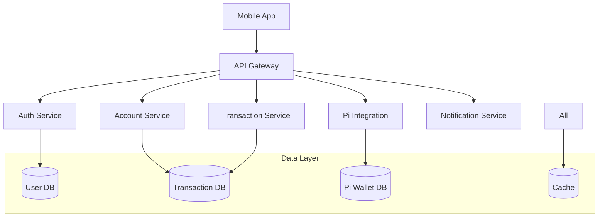

[](https://www.imf.org)
[](https://www.worldbank.org)
[](https://www.adb.org)
[](https://www.ecb.europa.eu)
[](https://www.bis.org)
[](https://www.afdb.org)
[](https://www.iadb.org)
[](https://www.ifc.org)
[](https://www.oecd.org)
[](https://www.g20.org)

[](https://www.cbe.org.eg)
[](https://www.dfsa.ae)
[](https://www.sama.gov.sa)
[](https://www.cbb.gov.bh)
[](https://www.qcb.gov.qa)
[](https://www.adgm.com)
[](https://www.cbk.gov.kw)
[](https://www.cbo.gov.om)
[](https://www.cbj.gov.jo)
[](https://www.ifsb.org)

[](https://www.cfp.net/)
[](https://www.aicpa.org/)
[](https://www.cfainstitute.org/)
[](https://www.cisi.org/)
[](https://www.cisi.org/cisiweb2/education/qualifications/islamic-finance-qualification)
[](https://www.cifp.org/)
[](https://www.irmi.com/)
[](https://www.garp.org/frm)
[](https://www.afponline.org/)
[](https://www.imanet.org/)
  
  [](https://www.cfp.net/)
    [](https://www.cfainstitute.org/)
    [](https://www.aicpa.org/)
  [](https://www.garp.org/)
  [](https://www.imanet.org/)
  [](https://www.blockchain-council.org/) 
  [](https://online.stanford.edu/courses/sohs-ystanford-blockchain)
  [](https://www.blockchain-council.org/)
  [](https://www.blockchain-council.org/)
  [](https://www.hyperledger.org/)
  [](https://extension.berkeley.edu/)
  [](https://www.blockchain-council.org/)
  [](https://www.edx.org/)
  [](https://www.cryptocurrencycertification.com/)
  [](https://www.blockchain-council.org/)

# First PIMISR Bank Elmahrosa (FPBE) Mobile Banking Application

A groundbreaking mobile banking platform that integrates traditional banking services with Pi Network cryptocurrency capabilities, providing a secure, scalable, and compliant financial services solution.

## 🌟 Features

- Unified banking and cryptocurrency management
- Real-time transaction processing
- Biometric authentication
- Pi Network mining integration
- Virtual card management
- Global payment capabilities
- Multi-factor authentication
- End-to-end encryption

## 🏗 System Architecture

The FPBE mobile banking system utilizes a microservices architecture with event-driven communication:



## 🛠 Technology Stack

### Mobile Application
- React Native 0.71+
- TypeScript 4.9+
- Native Base UI
- Redux Toolkit

### Backend Services
- Java 17 LTS (Spring Boot 3.0+)
- Node.js 18 LTS
- Python 3.11+ (Microservices)

### Data Storage
- PostgreSQL 15+
- MongoDB 6.0+
- Redis 7.0+
- Elasticsearch

### Infrastructure
- AWS Services
- Kubernetes 1.25+
- Docker
- Kong API Gateway 3.2+

### Security
- Spring Security 6.0+
- JWT Authentication
- Hardware Security Modules (HSM)
- Multi-factor Authentication

## 🚀 Getting Started

### Prerequisites

- Node.js 18 LTS
- Java 17 LTS
- Docker Desktop
- Kubernetes CLI
- AWS CLI
- Git

### Development Setup

1. Clone the repository:
```bash
git clone https://github.com/fpbe/mobile-banking.git
cd mobile-banking
```

2. Install dependencies:
```bash
# Backend services
cd src/backend
./mvnw install

# Mobile application
cd src/web
npm install
```

3. Configure environment:
```bash
# Copy environment templates
cp .env.example .env
cp config/application.yml.example config/application.yml
```

4. Start development environment:
```bash
# Start backend services
docker-compose up -d

# Start mobile app
npm run start
```

## 📚 Documentation

- [Backend Services](src/backend/README.md)
- [Mobile Application](src/web/README.md)
- [Infrastructure Setup](infrastructure/README.md)

## 🔒 Security & Compliance

The application implements comprehensive security measures:

- End-to-end encryption
- Multi-factor authentication
- Biometric verification
- Hardware Security Module integration
- Real-time fraud detection
- Compliance with:
  - GDPR
  - PCI DSS
  - FinCEN regulations
  - SOC 2
  - ISO 27001

## 🤝 Contributing

1. Fork the repository
2. Create your feature branch (`git checkout -b feature/amazing-feature`)
3. Commit your changes (`git commit -m 'Add amazing feature'`)
4. Push to the branch (`git push origin feature/amazing-feature`)
5. Open a Pull Request

### Development Guidelines

- Follow the established code style guide
- Write comprehensive tests
- Update documentation
- Ensure security best practices
- Perform performance testing

## 📋 Project Structure

```
fpbe-mobile-banking/
├── src/
│   ├── backend/         # Backend microservices
│   ├── web/            # React Native application
│   └── common/         # Shared utilities
├── infrastructure/     # Infrastructure as code
├── docs/              # Detailed documentation
├── tests/             # Test suites
├── scripts/           # Utility scripts
├── config/            # Configuration templates
└── .github/           # GitHub workflows
```

## 🔍 Monitoring & Observability

- Prometheus metrics collection
- Grafana dashboards
- ELK Stack for logging
- Jaeger for distributed tracing
- Real-time alerting

## 📄 License

This project is licensed under the [MIT License](LICENSE)

## 🆘 Support

For support and inquiries:
- Technical Support: [support@fpbe.com](mailto:support@fpbe.com)
- Security Issues: [security@fpbe.com](mailto:security@fpbe.com)
- Documentation: [docs.fpbe.com](https://docs.fpbe.com)

## 🏦 About FPBE

First PIMISR Bank Elmahrosa (FPBE) is committed to providing innovative financial solutions that bridge traditional banking with cryptocurrency capabilities, ensuring secure, compliant, and accessible services for our global customer base.
