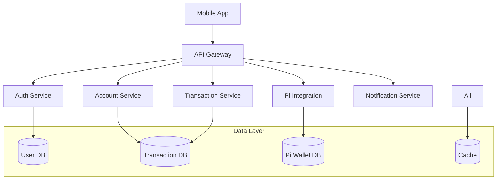

[](https://www.imf.org)
[](https://www.worldbank.org)
[](https://www.adb.org)
[](https://www.ecb.europa.eu)
[](https://www.bis.org)
[](https://www.afdb.org)
[](https://www.iadb.org)
[](https://www.ifc.org)
[](https://www.oecd.org)
[](https://www.g20.org)

[](https://www.iso.org/iso-9001-quality-management.html)
[](https://www.iso.org/iso-14001-environmental-management.html)
[](https://www.iso.org/iso-27001-information-security.html)
[](https://www.iso.org/iso-45001-occupational-health-and-safety.html)
[](https://www.iso.org/iso-50001-energy-management.html)
[](https://www.iso.org/iso-22000-food-safety-management.html)
[](https://www.iso.org/iso-13485-medical-devices.html)
[](https://www.iso.org/iso-20121-sustainable-events.html)
[](https://www.iso.org/iso-26000-social-responsibility.html)
[](https://www.iso.org/iso-31000-risk-management.html)
[](https://www.iso.org/iso-37001-anti-bribery-management.html)
[](https://www.iso.org/iso-45003-psychological-health.html)
[](https://www.iso.org/iso-22301-business-continuity.html)
[](https://www.iso.org/iso-50002-energy-management-systems.html)
[](https://www.iso.org/iso-19650-building-information-modeling.html)
[](https://www.iso.org/iso-20022.html)

[](https://www.cbi.iq)
[](https://www.cbe.org.eg)
[](https://www.dfsa.ae)
[](https://www.sama.gov.sa)
[](https://www.cbb.gov.bh)
[](https://www.qcb.gov.qa)
[](https://www.adgm.com)
[](https://www.cbk.gov.kw)
[](https://www.cbo.gov.om)
[](https://www.cbj.gov.jo)
[](https://www.ifsb.org)

[](https://www.cfp.net/)
[](https://www.aicpa.org/)
[](https://www.cfainstitute.org/)
[](https://www.cisi.org/)
[](https://www.cisi.org/cisiweb2/education/qualifications/islamic-finance-qualification)
[](https://www.cifp.org/)
[](https://www.irmi.com/)
[](https://www.garp.org/frm)
[](https://www.afponline.org/)
[](https://www.imanet.org/)
  
  [](https://www.cfp.net/)
    [](https://www.cfainstitute.org/)
    [](https://www.aicpa.org/)
  [](https://www.garp.org/)
  [](https://www.imanet.org/)
  [](https://www.blockchain-council.org/) 
  [](https://online.stanford.edu/courses/sohs-ystanford-blockchain)
  [](https://www.blockchain-council.org/)
  [](https://www.blockchain-council.org/)
  [](https://www.hyperledger.org/)
  [](https://extension.berkeley.edu/)
  [](https://www.blockchain-council.org/)
  [](https://www.edx.org/)
  [](https://www.cryptocurrencycertification.com/)
  [](https://www.blockchain-council.org/)

[](https://www.iso.org/iso-27001-information-security.html)
[](https://www.nist.gov/cyberframework)
[](https://www.cisecurity.org/controls/)
[](https://www.pcisecuritystandards.org/)
[](https://www.aicpa.org/soc)
[](https://gdpr.eu/)
[](https://www.iso.org/iso-27017-cloud-security.html)
[](https://www.iso.org/iso-27018-protecting-personal-data.html)
[](https://cmmiinstitute.com/)
[](https://www.cyberessentials.ncsc.gov.uk/)

<p xmlns:cc="http://creativecommons.org/ns#" xmlns:dct="http://purl.org/dc/terms/"><a property="dct:title" rel="cc:attributionURL" href="https://github.com/Aymanseif/FPBE-First-Pimisr-Bank-Elmahrosa--ez2igr">Elmahrosa Bank</a> by <a rel="cc:attributionURL dct:creator" property="cc:attributionName" href="https://www.linkedin.com/in/aymanseif">Ayman Seif</a> is licensed under <a href="https://creativecommons.org/licenses/by/4.0/?ref=chooser-v1" target="_blank" rel="license noopener noreferrer" style="display:inline-block;">Creative Commons Attribution 4.0 International</a></p>

# First PIMISR Bank Elmahrosa (FPBE) Mobile Banking Application

A groundbreaking mobile banking platform that integrates traditional banking services with Pi Network cryptocurrency capabilities, providing a secure, scalable, and compliant financial services solution.

## 🌟 Features

- Unified banking and cryptocurrency management
- Real-time transaction processing
- Biometric authentication
- Pi Network mining integration
- Virtual card management
- Global payment capabilities
- Multi-factor authentication
- End-to-end encryption

## 🏗 System Architecture

The FPBE mobile banking system utilizes a microservices architecture with event-driven communication:



## 🛠 Technology Stack

### Mobile Application
- React Native 0.71+
- TypeScript 4.9+
- Native Base UI
- Redux Toolkit

### Backend Services
- Java 17 LTS (Spring Boot 3.0+)
- Node.js 18 LTS
- Python 3.11+ (Microservices)

### Data Storage
- PostgreSQL 15+
- MongoDB 6.0+
- Redis 7.0+
- Elasticsearch

### Infrastructure
- AWS Services
- Kubernetes 1.25+
- Docker
- Kong API Gateway 3.2+

### Security
- Spring Security 6.0+
- JWT Authentication
- Hardware Security Modules (HSM)
- Multi-factor Authentication

## Getting Started with FPBE First Pimisr Bank Elmahrosa

This guide provides instructions to set up and deploy the FPBE mobile banking application for development and production environments.

## Prerequisites

Ensure you have the following installed:
- *Node.js* (v18 LTS): [Download](https://nodejs.org/en/download/)
- *Java* (JDK 17 LTS): [Download](https://adoptium.net/)
- *Docker Desktop*: [Download](https://www.docker.com/products/docker-desktop/)
- *Kubernetes CLI (kubectl)*: [Install](https://kubernetes.io/docs/tasks/tools/)
- *AWS CLI* (v2): [Install](https://aws.amazon.com/cli/)
- *Git*: [Download](https://git-scm.com/downloads/)

## Development Setup

### 1. Clone the Repository

    git clone https://github.com/Aymanseif/FPBE-First-Pimisr-Bank-Elmahrosa.git
    cd FPBE-First-Pimisr-Bank-Elmahrosa
### 2. Install Dependencies
Backend Services

    cd backend
    ./mvnw clean install
This installs all required Java dependencies using Maven.
Mobile Application
    
    cd ../web
    npm install
This installs Node.js dependencies for the mobile frontend.
### 3. Configure Environment
Copy and configure environment files:

# Backend configuration

    cd backend
    cp src/main/resources/application.yml.example src/main/resources/application.yml

# Frontend configuration
    cd ../web
    cp .env.example .env
Edit the following files with your environment-specific values:
backend/src/main/resources/application.yml: Update database credentials, API keys, and other service configurations.
web/.env: Set API endpoints, AWS credentials, and other frontend configurations.
### 4. Start Development Environment
Backend Services
Run the backend services using Docker Compose:
    
    cd backend
    docker-compose up -d
This starts the backend services (e.g., API server, database) in detached mode.
Mobile Application
Run the mobile app in development mode:

    cd ../web
    npm run dev
This starts the frontend development server, typically accessible at http://localhost:3000.
Deployment Setup
1. Build Docker Images
### Backend
    cd backend
    docker build -t fpbe-backend:latest .
### Frontend
2. Push Images to Registry
Push the built images to your container registry (e.g., AWS ECR):

# Authenticate with AWS ECR
    aws ecr get-login-password --region <your-region> | docker login --username AWS --password-stdin <your-ecr-repo-uri>

# Tag and push backend image
    docker tag fpbe-backend:latest <your-ecr-repo-uri>/fpbe-backend:latest
    docker push <your-ecr-repo-uri>/fpbe-backend:latest

# Tag and push frontend image
    docker tag fpbe-frontend:latest <your-ecr-repo-uri>/fpbe-frontend:latest
    docker push <your-ecr-repo-uri>/fpbe-frontend:latest
    Replace <your-region> and <your-ecr-repo-uri> with your AWS region and ECR repository URI.
3. Deploy to Kubernetes
Ensure kubectl is configured to connect to your Kubernetes cluster (e.g., EKS).
Apply Kubernetes manifests:
```bash
cd kubernetes
kubectl apply -f backend-deployment.yml
kubectl apply -f frontend-deployment.yml
kubectl apply -f backend-service.yml
kubectl apply -f frontend-service.yml
```
Ensure the kubernetes/ directory contains the necessary YAML files for deployments and services. Example files:
backend-deployment.yml: Defines the backend deployment with replicas and container specs.
frontend-deployment.yml: Defines the frontend deployment.
backend-service.yml: Exposes the backend API.
frontend-service.yml: Exposes the frontend application.

4. Verify Deployment
Check the status of your pods and services:
```bash
kubectl get pods
kubectl get services
```
Access the application via the external URL or LoadBalancer endpoint provided by the frontend service.
Additional Notes
Ensure AWS credentials are configured for ECR and EKS access.
Update application.yml and .env with production-ready values (e.g., secure database credentials, API keys).
For HTTPS, configure an Ingress controller or use AWS ALB with SSL certificates.
Monitor logs using:
```bash
kubectl logs -l app=fpbe-backend
kubectl logs -l app=fpbe-frontend
```
Troubleshooting
Docker build failures: Verify Dockerfile paths and dependencies.
Kubernetes errors: Check pod logs and ensure correct AWS IAM roles.
Environment issues: Validate .env and application.yml configurations.
For further assistance, create an issue in the GitHub repository.
## 📚 Documentation

- [Backend Services](src/backend/README.md)
- [Mobile Application](src/web/README.md)
- [Infrastructure Setup](infrastructure/README.md)

## 🔒 Security & Compliance

The application implements comprehensive security measures:

- End-to-end encryption
- Multi-factor authentication
- Biometric verification
- Hardware Security Module integration
- Real-time fraud detection
- Compliance with:
  - GDPR
  - PCI DSS
  - FinCEN regulations
  - SOC 2
  - ISO 27001

## 🤝 Contributing

1. Fork the repository
2. Create your feature branch (`git checkout -b feature/amazing-feature`)
3. Commit your changes (`git commit -m 'Add amazing feature'`)
4. Push to the branch (`git push origin feature/amazing-feature`)
5. Open a Pull Request

### Development Guidelines

- Follow the established code style guide
- Write comprehensive tests
- Update documentation
- Ensure security best practices
- Perform performance testing

## 📋 Project Structure

```
fpbe-mobile-banking/
├── src/
│   ├── backend/         # Backend microservices
│   ├── web/            # React Native application
│   └── common/         # Shared utilities
├── infrastructure/     # Infrastructure as code
├── docs/              # Detailed documentation
├── tests/             # Test suites
├── scripts/           # Utility scripts
├── config/            # Configuration templates
└── .github/           # GitHub workflows
```

## 🔍 Monitoring & Observability

- Prometheus metrics collection
- Grafana dashboards
- ELK Stack for logging
- Jaeger for distributed tracing
- Real-time alerting

## 📄 License

This project is licensed under the [MIT License](LICENSE)

## 🆘 Support

For support and inquiries:
- Technical Support: [support@fpbe.com](mailto:support@fpbe.com)
- Security Issues: [security@fpbe.com](mailto:security@fpbe.com)
- Documentation: [docs.fpbe.com](https://docs.fpbe.com)

## 🏦 About FPBE

First PIMISR Bank Elmahrosa (FPBE) is committed to providing innovative financial solutions that bridge traditional banking with cryptocurrency capabilities, ensuring secure, compliant, and accessible services for our global customer base.

# FPBE-First-Pimisr-Bank-Elmahrosa

## 🚀 Getting Started

This guide will help you set up and deploy the application for development and deployment purposes.

---

### Prerequisites

Ensure you have the following installed on your system:

- **Node.js** 18 LTS
- **Java** 17 LTS
- **Docker Desktop**
- **Kubernetes CLI** (`kubectl`)
- **AWS CLI**
- **Git**

---

### Development Setup

#### 1. Clone the repository

```bash
git clone https://github.com/Aymanseif/FPBE-First-Pimisr-Bank-Elmahrosa.git
cd FPBE-First-Pimisr-Bank-Elmahrosa
```

#### 2. Install dependencies

##### Backend Services

```bash
cd src/backend
./mvnw install
```

##### Mobile Application

```bash
cd ../../src/web
npm install
```

#### 3. Configure environment

Copy the example environment files to create your local configuration:

```bash
cp .env.example .env
cp config/application.yml.example config/application.yml
```

If there are additional environment files (for backend or web), copy those as needed:

```bash
cd ../backend
cp .env.example .env  # If exists

cd ../../web
cp .env.example .env  # If exists
```

Edit `.env` and `config/application.yml` as required for your environment.

---

#### 4. Start development environment

##### Start backend services

In the `src/backend` directory:

```bash
docker-compose up -d
```

##### Start mobile/web app

In the `src/web` directory:

```bash
npm run start
```

---

### Deployment Notes

- Ensure your AWS CLI is configured with the correct credentials (`aws configure`).
- For Kubernetes deployment, ensure your cluster is accessible and your `kubectl` context is set.
- For production deployments, adjust environment variables and configuration files accordingly.

---

### Troubleshooting

- If you experience errors, ensure all prerequisites are installed and environment files are correctly configured.
- Check Docker and Kubernetes are running.
- For dependency issues, try deleting `node_modules` or `target` and reinstalling.

---

### Contributing

Pull requests are welcome! For major changes, please open an issue first to discuss what you would like to change.

---

### License

[MIT](LICENSE)
