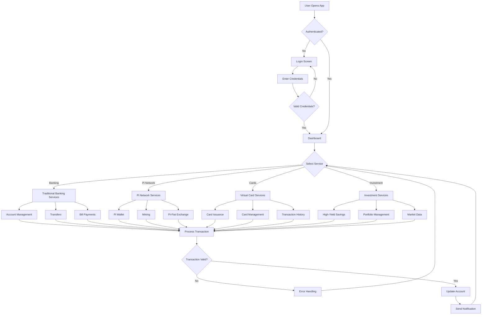
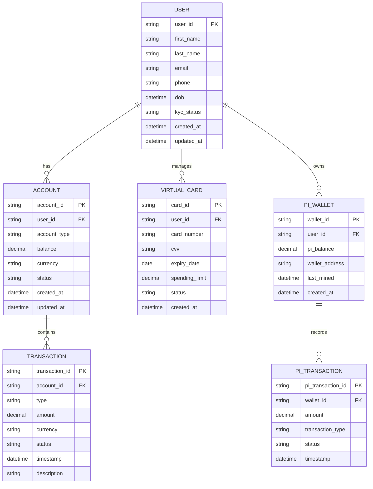
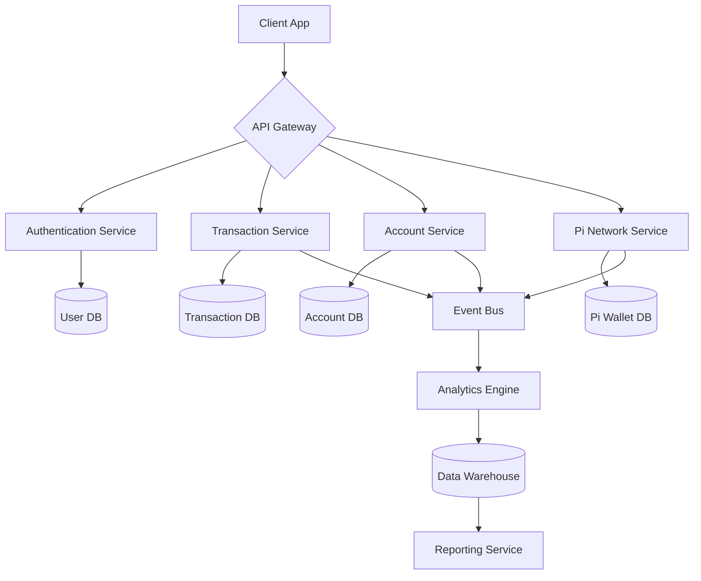
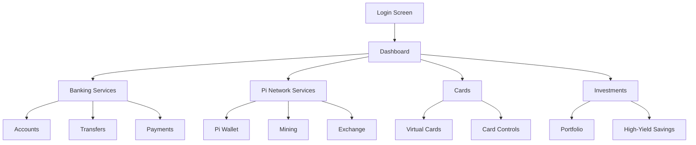
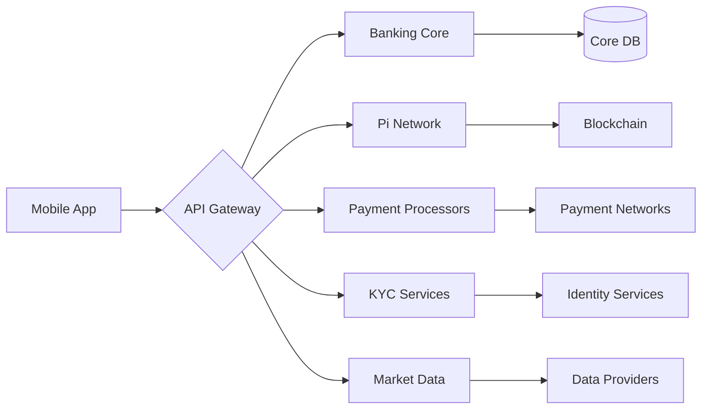

# Product Requirements Document (PRD)

# 1. INTRODUCTION

## 1.1 Purpose

This Software Requirements Specification (SRS) document provides a comprehensive description of the First PIMISR Bank Elmahrosa (FPBE) mobile banking application. It is intended for:

- Development teams implementing the application
- Project managers overseeing development
- Quality assurance teams conducting testing
- Bank stakeholders reviewing technical specifications
- Pi Network integration specialists
- Regulatory compliance officers

## 1.2 Scope

The FPBE mobile application is a full-featured digital banking platform that uniquely integrates with the Pi Network cryptocurrency ecosystem. The application will:

- Provide secure traditional banking services including accounts, transfers, and payments
- Enable cryptocurrency transactions and Pi mining capabilities
- Issue and manage virtual payment cards
- Support international money transfers
- Offer investment and high-yield savings products

Key benefits include:

- Seamless integration between traditional banking and cryptocurrency
- Enhanced security through blockchain technology
- Reduced transaction costs using Pi Network
- Global accessibility and multi-currency support
- Revenue generation through Pi mining features

Core functionalities encompass:

- Multi-factor authenticated user access
- Real-time account management and monitoring
- Pi Network wallet integration and mining
- Cryptocurrency-to-fiat conversion
- Virtual card issuance and control
- Domestic and international transfers
- Investment account management
- Automated bill payments and scheduling
- Real-time notifications and alerts
- Multi-language user interface

The application will be developed for both iOS and Android platforms using cross-platform development frameworks to ensure consistent functionality and user experience across devices.

# 2. PRODUCT DESCRIPTION

## 2.1 Product Perspective

The FPBE mobile banking application operates as a comprehensive digital banking solution within the larger financial services ecosystem. It uniquely bridges traditional banking infrastructure with the Pi Network cryptocurrency platform through:

- Integration with core banking systems for account management and transactions
- Direct connection to Pi Network's blockchain and mining infrastructure
- Interface with international payment networks and SWIFT
- Integration with regulatory compliance and KYC verification systems
- Connection to virtual card issuance and processing networks
- Interface with investment and trading platforms
- Integration with bill payment and merchant systems

## 2.2 Product Functions

The primary functions of the FPBE mobile application include:

| Function Category | Key Features |
|------------------|--------------|
| Account Services | - Multi-currency account management - Real-time balance tracking - Statement generation - Account alerts and notifications |
| Pi Network Features | - Integrated Pi wallet - Pi mining capabilities - Pi-to-fiat conversion - Blockchain transaction verification |
| Payment Services | - Domestic and international transfers - Bill payments and scheduling - QR code payments - Merchant payments |
| Card Management | - Virtual card issuance - Card controls and limits - Transaction monitoring - Card security features |
| Investment Services | - High-yield savings accounts - Investment portfolio management - Real-time market data - Automated investment tools |

## 2.3 User Characteristics

Target users fall into the following personas:

1. Digital Native Bankers
   - Age: 18-35
   - Tech-savvy
   - Frequent mobile banking users
   - Interested in cryptocurrency

2. Traditional Banking Customers
   - Age: 35-60
   - Moderate technical proficiency
   - Value security and reliability
   - New to cryptocurrency

3. International Users
   - Expatriates and travelers
   - Need multi-currency support
   - Regular international transfers
   - Cryptocurrency-aware

4. Business Users
   - Small to medium business owners
   - Require merchant services
   - Regular payment processing
   - Interest in crypto integration

## 2.4 Constraints

1. Technical Constraints
   - Must maintain compatibility with iOS 13+ and Android 8+
   - Required compliance with Pi Network SDK specifications
   - Maximum 100ms transaction processing time
   - 99.9% uptime requirement

2. Regulatory Constraints
   - Banking regulations compliance
   - KYC/AML requirements
   - Data protection laws (GDPR, local regulations)
   - Cryptocurrency trading restrictions

3. Business Constraints
   - Development timeline of 12 months
   - Integration with existing banking infrastructure
   - Market-competitive transaction fees
   - 24/7 support requirements

## 2.5 Assumptions and Dependencies

Assumptions:
- Pi Network maintains stable API endpoints
- Users have reliable internet connectivity
- Mobile devices meet minimum hardware requirements
- Banking partners maintain service availability
- Regulatory environment remains stable

Dependencies:
- Pi Network blockchain infrastructure
- Third-party payment processors
- Banking core system availability
- KYC verification services
- Card issuance network services
- Exchange rate data providers
- Security certificate authorities
- Cloud infrastructure providers

# 3. PROCESS FLOWCHART

# 4. FUNCTIONAL REQUIREMENTS

## 4.1 Authentication and Security

### ID: FR-1
### Description
Multi-factor authentication system with biometric, PIN, and password options
### Priority
Critical
### Requirements

| Requirement ID | Description | Validation Criteria |
|---------------|-------------|-------------------|
| FR-1.1 | Implement biometric authentication (fingerprint, face recognition) | Must work on iOS 13+ and Android 8+ |
| FR-1.2 | PIN-based authentication with configurable length | 4-8 digit support |
| FR-1.3 | Password authentication with complexity requirements | Min 8 chars, special chars, numbers |
| FR-1.4 | KYC verification integration | Compliance with banking regulations |
| FR-1.5 | Session management and automatic logout | After 5 minutes of inactivity |

## 4.2 Account Management

### ID: FR-2
### Description
Comprehensive account management system supporting multiple account types
### Priority
Critical
### Requirements

| Requirement ID | Description | Validation Criteria |
|---------------|-------------|-------------------|
| FR-2.1 | Create and manage multiple account types | Savings, Checking, Investment |
| FR-2.2 | Real-time balance display and updates | < 100ms refresh rate |
| FR-2.3 | Transaction history with filtering | Last 12 months minimum |
| FR-2.4 | Statement generation and export | PDF, CSV formats |
| FR-2.5 | Account alerts and notifications | Push, SMS, email options |

## 4.3 Pi Network Integration

### ID: FR-3
### Description
Full integration with Pi Network ecosystem and mining capabilities
### Priority
High
### Requirements

| Requirement ID | Description | Validation Criteria |
|---------------|-------------|-------------------|
| FR-3.1 | Pi Network SDK implementation | Latest SDK version compatibility |
| FR-3.2 | Pi mining functionality | Background mining support |
| FR-3.3 | Pi wallet integration | Real-time balance sync |
| FR-3.4 | Blockchain transaction verification | < 30 second confirmation |
| FR-3.5 | Pi-to-fiat conversion | Real-time exchange rates |

## 4.4 Payment Services

### ID: FR-4
### Description
Comprehensive payment and transfer functionality
### Priority
High
### Requirements

| Requirement ID | Description | Validation Criteria |
|---------------|-------------|-------------------|
| FR-4.1 | Domestic transfers | Instant transfer capability |
| FR-4.2 | International transfers | SWIFT integration |
| FR-4.3 | Bill payments and scheduling | Recurring payment support |
| FR-4.4 | QR code payments | Generate and scan capability |
| FR-4.5 | Merchant payment processing | < 3 second processing time |

## 4.5 Virtual Card Management

### ID: FR-5
### Description
Virtual card issuance and management system
### Priority
Medium
### Requirements

| Requirement ID | Description | Validation Criteria |
|---------------|-------------|-------------------|
| FR-5.1 | Virtual card issuance | Instant card generation |
| FR-5.2 | Card controls and limits | Real-time limit adjustments |
| FR-5.3 | Transaction monitoring | Real-time notifications |
| FR-5.4 | Card security features | 3D Secure compliance |
| FR-5.5 | Multiple card management | Up to 5 cards per user |

## 4.6 Investment Services

### ID: FR-6
### Description
Investment account management and high-yield savings features
### Priority
Medium
### Requirements

| Requirement ID | Description | Validation Criteria |
|---------------|-------------|-------------------|
| FR-6.1 | High-yield savings accounts | Daily interest calculation |
| FR-6.2 | Investment portfolio management | Real-time portfolio updates |
| FR-6.3 | Market data integration | < 15 min delay |
| FR-6.4 | Automated investment tools | Scheduled investment support |
| FR-6.5 | Investment reports and analytics | Monthly performance reports |

## 4.7 User Experience

### ID: FR-7
### Description
Interface and user experience features
### Priority
High
### Requirements

| Requirement ID | Description | Validation Criteria |
|---------------|-------------|-------------------|
| FR-7.1 | Multi-language support | Minimum 5 languages |
| FR-7.2 | Push notifications | < 1 second delivery |
| FR-7.3 | In-app support chat | 24/7 availability |
| FR-7.4 | Customizable dashboard | User-defined widgets |
| FR-7.5 | Accessibility features | WCAG 2.1 compliance |

# 5. NON-FUNCTIONAL REQUIREMENTS

## 5.1 Performance Requirements

| Category | Requirement | Target Metric |
|----------|-------------|---------------|
| Response Time | API Response | < 100ms for 95% of requests |
| | Page Load | < 2 seconds initial load |
| | Transaction Processing | < 3 seconds for standard transactions |
| Throughput | Concurrent Users | Support 100,000 simultaneous users |
| | Transactions per Second | Handle 1000 TPS peak load |
| Resource Usage | CPU Utilization | < 70% under normal load |
| | Memory Usage | < 100MB per active user session |
| | Network Bandwidth | < 1MB per minute per active user |

## 5.2 Safety Requirements

| Category | Requirement | Implementation |
|----------|-------------|----------------|
| Data Backup | Real-time Replication | Continuous data mirroring to backup servers |
| | Backup Frequency | Full backup daily, incremental every hour |
| Disaster Recovery | Recovery Time Objective | < 4 hours for full system recovery |
| | Recovery Point Objective | < 15 minutes of data loss maximum |
| Failover | System Redundancy | Active-active configuration across multiple regions |
| | Automatic Failover | < 30 seconds switchover time |
| Transaction Safety | Atomic Transactions | ACID compliance for all financial transactions |
| | Transaction Rollback | Automatic rollback for failed transactions |

## 5.3 Security Requirements

| Category | Requirement | Specification |
|----------|-------------|---------------|
| Authentication | Multi-factor Authentication | Biometric, PIN, and password options |
| | Session Management | Auto-logout after 5 minutes inactivity |
| Authorization | Role-based Access | Granular permission system with least privilege |
| | API Security | OAuth 2.0 and JWT implementation |
| Encryption | Data at Rest | AES-256 encryption for stored data |
| | Data in Transit | TLS 1.3 for all communications |
| Privacy | Data Protection | GDPR and local privacy law compliance |
| | Data Retention | Configurable retention periods by data type |

## 5.4 Quality Requirements

| Category | Requirement | Target Metric |
|----------|-------------|---------------|
| Availability | System Uptime | 99.99% availability (< 52 minutes downtime/year) |
| | Service Level Agreement | 99.9% for critical services |
| Maintainability | Code Coverage | > 80% unit test coverage |
| | Documentation | Complete API and code documentation |
| Usability | Error Rate | < 1% user error rate |
| | User Satisfaction | > 4.5/5 app store rating |
| Scalability | Horizontal Scaling | Auto-scaling based on load metrics |
| | Data Growth | Support 50% annual user growth |
| Reliability | Mean Time Between Failures | > 720 hours |
| | Bug Resolution Time | < 24 hours for critical bugs |

## 5.5 Compliance Requirements

| Category | Requirement | Standard/Regulation |
|----------|-------------|-------------------|
| Banking Regulations | Core Banking | Basel III compliance |
| | Transaction Reporting | SWIFT messaging standards |
| Data Protection | Privacy | GDPR, CCPA compliance |
| | Data Localization | Country-specific data storage requirements |
| Security Standards | Payment Processing | PCI DSS compliance |
| | System Security | ISO 27001 certification |
| Cryptocurrency | Pi Network | Compliance with Pi Network protocols |
| | Digital Assets | Local cryptocurrency regulations |
| Accessibility | Interface | WCAG 2.1 Level AA compliance |
| | Mobile Apps | iOS and Android accessibility guidelines |

# 6. DATA REQUIREMENTS

## 6.1 Data Models

## 6.2 Data Storage

### 6.2.1 Primary Storage
- Distributed PostgreSQL cluster for transactional data
- Redis cluster for caching and session management
- MongoDB cluster for unstructured data and logs

### 6.2.2 Data Retention
| Data Type | Retention Period | Storage Type |
|-----------|-----------------|--------------|
| Transaction Records | 7 years | PostgreSQL with archival |
| Account Statements | 7 years | Object Storage |
| User Activity Logs | 2 years | MongoDB |
| Session Data | 24 hours | Redis |
| KYC Documents | 7 years | Encrypted Object Storage |
| System Logs | 1 year | MongoDB |

### 6.2.3 Backup Strategy
- Real-time synchronous replication across multiple availability zones
- Hourly incremental backups
- Daily full backups retained for 30 days
- Monthly backups retained for 7 years
- Geo-redundant backup storage across multiple regions

### 6.2.4 Recovery Procedures
- Automated failover for high availability
- Point-in-time recovery capability up to 30 days
- Maximum 15-minute Recovery Point Objective (RPO)
- 4-hour Recovery Time Objective (RTO)
- Automated backup verification and restoration testing

## 6.3 Data Processing

### 6.3.1 Data Flow

### 6.3.2 Data Security
| Layer | Security Measure |
|-------|-----------------|
| Transport | TLS 1.3 encryption |
| Storage | AES-256 encryption at rest |
| Application | Field-level encryption for sensitive data |
| Database | Transparent data encryption |
| Backup | Encrypted backup storage |
| Access | Role-based access control (RBAC) |

### 6.3.3 Data Processing Requirements
- Real-time transaction processing with < 100ms latency
- Batch processing for daily reconciliation
- Stream processing for fraud detection
- Event-driven architecture for system integration
- Data validation and sanitization at all entry points
- Automated data classification and handling
- Compliance with data protection regulations

### 6.3.4 Data Integration
- Real-time Pi Network blockchain integration
- Banking core system integration
- Payment gateway integration
- KYC/AML service integration
- Credit bureau integration
- Market data feed integration

# 7. EXTERNAL INTERFACES

## 7.1 User Interfaces

### 7.1.1 Mobile Application Interface

| Screen | Key UI Elements | Requirements |
|--------|----------------|--------------|
| Login | - Biometric scanner - PIN pad - Password field | - High contrast for accessibility - Error feedback - Loading indicators |
| Dashboard | - Account summaries - Quick actions - Notifications | - Customizable widgets - Real-time updates - Pull-to-refresh |
| Banking | - Account lists - Transaction history - Action buttons | - Search functionality - Filtering options - Export capabilities |
| Pi Network | - Mining status - Wallet balance - Exchange rates | - Real-time mining indicators - Transaction confirmations - Rate alerts |
| Cards | - Card visualization - Control toggles - Usage statistics | - 3D card rendering - Gesture controls - Security indicators |
| Investments | - Portfolio charts - Performance metrics - Investment options | - Interactive graphs - Risk indicators - Market data |

### 7.1.2 Accessibility Requirements

- WCAG 2.1 Level AA compliance
- VoiceOver/TalkBack support
- Dynamic text sizing
- Color contrast ratios ≥ 4.5:1
- Touch target size ≥ 44px
- Alternative text for all images
- Keyboard navigation support

## 7.2 Hardware Interfaces

### 7.2.1 Mobile Device Requirements

| Component | Specification | Purpose |
|-----------|--------------|----------|
| Camera | Min 5MP resolution | QR code scanning, document capture |
| Biometric Sensors | Fingerprint/Face ID | Authentication |
| GPS | Location Services | Fraud prevention, ATM locator |
| NFC | ISO/IEC 14443 | Contactless payments |
| Storage | Min 100MB free space | App installation and data |
| RAM | Min 2GB | App performance |
| Network | 4G/WiFi | Data connectivity |

### 7.2.2 Security Hardware

| Component | Interface Type | Purpose |
|-----------|---------------|----------|
| HSM | PKCS#11 | Cryptographic operations |
| TPM | TPM 2.0 | Secure key storage |
| Secure Element | GlobalPlatform | Payment credentials |

## 7.3 Software Interfaces

### 7.3.1 External Systems Integration

| System | Interface Type | Purpose |
|--------|---------------|----------|
| Core Banking | REST API | Account management, transactions |
| Pi Network | SDK/API | Cryptocurrency operations |
| Payment Gateway | REST API | Payment processing |
| KYC Provider | REST API | Identity verification |
| Credit Bureau | SOAP API | Credit checks |
| Market Data | WebSocket | Real-time financial data |

### 7.3.2 Database Interfaces

| Database | Interface | Purpose |
|----------|-----------|----------|
| PostgreSQL | JDBC/ODBC | Transactional data |
| Redis | Redis Protocol | Caching, sessions |
| MongoDB | MongoDB Wire Protocol | Unstructured data |

## 7.4 Communication Interfaces

### 7.4.1 Network Protocols

| Protocol | Usage | Requirements |
|----------|-------|--------------|
| HTTPS | API Communication | TLS 1.3, Certificate Pinning |
| WebSocket | Real-time Updates | WSS, Heartbeat monitoring |
| gRPC | Internal Services | HTTP/2, Protobuf encoding |
| MQTT | Push Notifications | QoS Level 2, TLS encryption |

### 7.4.2 Data Formats

| Format | Usage | Validation |
|--------|-------|------------|
| JSON | API Responses | JSON Schema validation |
| Protobuf | Service Communication | Proto3 specification |
| ISO 20022 | Financial Messages | XML Schema validation |
| JWT | Authentication | RS256 signature |

### 7.4.3 Integration Points

# 8. APPENDICES

## 8.1 GLOSSARY

| Term | Definition |
|------|------------|
| Blockchain | Distributed ledger technology used for recording and verifying transactions |
| Fiat Currency | Government-issued currency not backed by a physical commodity |
| KYC | Process of verifying the identity of customers |
| Mining | Process of validating cryptocurrency transactions and earning rewards |
| Virtual Card | Digital version of a payment card that exists only electronically |
| Wallet | Digital storage for cryptocurrencies and payment information |
| High-Yield Savings | Savings account offering above-average interest rates |
| SDK | Software Development Kit for building applications |
| API | Application Programming Interface for software communication |

## 8.2 ACRONYMS

| Acronym | Full Form |
|---------|-----------|
| FPBE | First PIMISR Bank Elmahrosa |
| API | Application Programming Interface |
| SDK | Software Development Kit |
| KYC | Know Your Customer |
| AML | Anti-Money Laundering |
| SWIFT | Society for Worldwide Interbank Financial Telecommunication |
| GDPR | General Data Protection Regulation |
| JWT | JSON Web Token |
| HSM | Hardware Security Module |
| TPM | Trusted Platform Module |
| REST | Representational State Transfer |
| SOAP | Simple Object Access Protocol |
| MQTT | Message Queuing Telemetry Transport |
| QoS | Quality of Service |
| WCAG | Web Content Accessibility Guidelines |
| ACID | Atomicity, Consistency, Isolation, Durability |
| TLS | Transport Layer Security |
| RBAC | Role-Based Access Control |

## 8.3 ADDITIONAL REFERENCES

### 8.3.1 Technical Documentation

| Resource | Description | URL |
|----------|-------------|-----|
| Pi Network SDK | Official SDK documentation | https://github.com/pi-apps/pi-sdk-integration-guide |
| Banking API Standards | Open Banking API specifications | https://www.openbanking.org.uk/standards/ |
| SWIFT Standards | Financial messaging standards | https://www.swift.com/standards |
| ISO 20022 | Financial data interchange standard | https://www.iso20022.org |
| PCI DSS | Payment security standards | https://www.pcisecuritystandards.org |

### 8.3.2 Regulatory Guidelines

| Resource | Description | URL |
|----------|-------------|-----|
| Basel III | Banking regulation framework | https://www.bis.org/bcbs/basel3.htm |
| GDPR | Data protection regulation | https://gdpr.eu |
| KYC Guidelines | Customer verification requirements | https://www.fatf-gafi.org |
| Banking Laws | Local banking regulations | [Country-specific] |

### 8.3.3 Development Resources

| Resource | Description | URL |
|----------|-------------|-----|
| React Native | Mobile app framework | https://reactnative.dev |
| PostgreSQL | Database documentation | https://www.postgresql.org/docs |
| Redis | Caching system | https://redis.io/documentation |
| MongoDB | NoSQL database | https://docs.mongodb.com |
| Docker | Containerization platform | https://docs.docker.com |

## 8.4 CHANGE LOG

| Version | Date | Description | Author |
|---------|------|-------------|---------|
| 1.0.0 | [Initial Date] | Initial PRD creation | [Author] |
| 1.0.1 | [Date] | Added Pi Network integration details | [Author] |
| 1.0.2 | [Date] | Updated security requirements | [Author] |
| 1.0.3 | [Date] | Added virtual card specifications | [Author] |

## 8.5 APPROVAL

| Role | Name | Signature | Date |
|------|------|-----------|------|
| Project Sponsor | | | |
| Technical Lead | | | |
| Product Manager | | | |
| Security Officer | | | |
| Compliance Officer | | | |