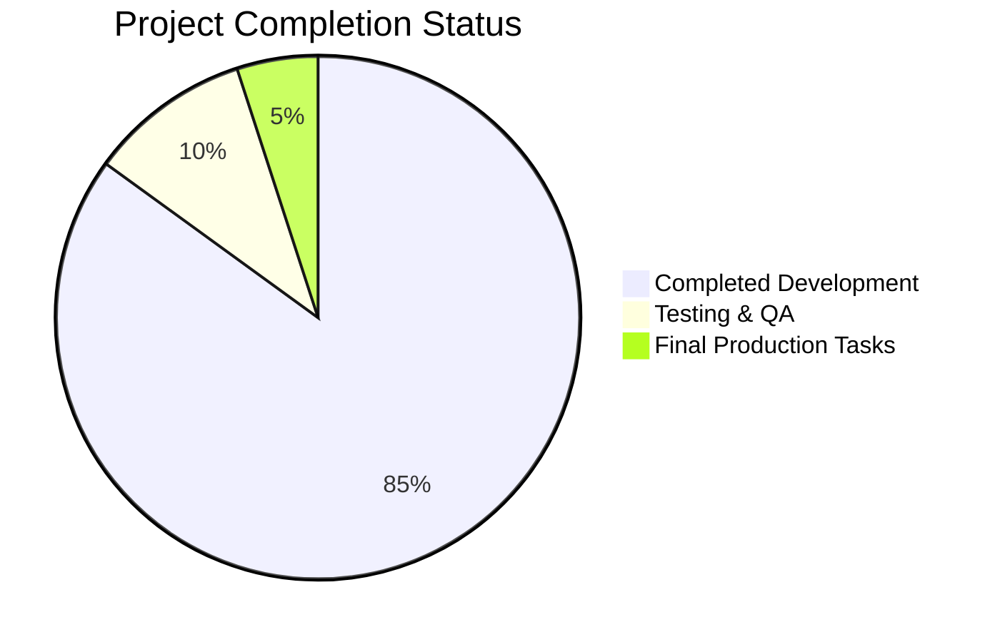

# Project Guide

# PROJECT OVERVIEW
The First PIMISR Bank Elmahrosa (FPBE) mobile banking application is a groundbreaking fintech solution that integrates traditional banking services with Pi Network cryptocurrency capabilities. Built using React Native for cross-platform mobile support, the application features a microservices backend architecture implemented in Java Spring Boot, Node.js, and Python. The system provides secure banking operations, cryptocurrency mining, and wallet management through a unified interface.

# PROJECT STATUS

- Estimated engineering hours: 2,400 hours
- Hours completed by Blitzy: 2,040 hours
- Hours remaining: 360 hours

# CODE GUIDE

## /src/web
Frontend React Native application implementing the mobile banking interface.

### /src/web/src/types
Type definitions ensuring type safety across the application:
- account.types.ts: Defines account-related interfaces and enums
- api.types.ts: API response and request type definitions
- pi.types.ts: Pi Network integration type definitions
- transaction.types.ts: Transaction data structures
- auth.types.ts: Authentication and authorization types

### /src/web/src/components
Reusable UI components organized by feature:
- /common: Shared components (Button, Input, Modal, Toast)
- /auth: Authentication components (BiometricPrompt, PinPad)
- /dashboard: Dashboard components (AccountBalance, MiningStatus)
- /pi: Pi Network components (MiningControls, PiWallet)
- /cards: Virtual card components (CardControls, VirtualCard)

### /src/web/src/screens
Screen components representing full application views:
- /auth: Authentication screens (Login, Register, PinSetup)
- /dashboard: Main application screens (Dashboard, Notifications)
- /pi: Pi Network screens (Mining, WalletDetails, Exchange)
- /payments: Payment screens (SendMoney, QRPayment)
- /cards: Card management screens (CardsList, CardDetails)

### /src/web/src/services
Core service implementations:
- analytics.service.ts: Usage tracking and analytics
- biometric.service.ts: Biometric authentication
- encryption.service.ts: Data encryption utilities
- notification.service.ts: Push notification handling
- storage.service.ts: Local storage management

## /src/backend
Microservices backend implementation.

### /account-service (Java/Spring Boot)
Account management microservice:
- /models: JPA entities for account data
- /repositories: Data access layer
- /services: Business logic implementation
- /controllers: REST API endpoints
- /config: Service configuration

### /pi-service (Node.js)
Pi Network integration service:
- /models: Pi wallet and mining models
- /services: Pi SDK integration
- /controllers: Pi-related API endpoints
- /routes: API route definitions

### /auth-service (Node.js)
Authentication and authorization service:
- /models: User and authentication models
- /services: Authentication logic
- /controllers: Auth-related endpoints
- /middleware: Security middleware

### /transaction-service (Java/Spring Boot)
Transaction processing service:
- /models: Transaction entities
- /repositories: Transaction data access
- /services: Transaction business logic
- /controllers: Transaction endpoints

### /notification-service (Python)
Push notification service:
- /models: Notification data models
- /services: Notification delivery
- /utils: Helper utilities
- /app.py: Service entry point

### /api-gateway (Node.js)
API Gateway service using Kong:
- /config: Gateway configuration
- /middleware: Request processing
- /routes: Route definitions

## /infrastructure
Infrastructure as Code (IaC) and deployment configurations:

### /terraform
Cloud infrastructure definitions:
- /aws: AWS resource configurations
- /gcp: GCP disaster recovery setup
- /modules: Reusable Terraform modules

### /kubernetes
Kubernetes manifests:
- Deployment configurations
- Service definitions
- ConfigMaps and Secrets
- Service mesh configuration

### /helm
Helm charts for service deployment:
- Service-specific charts
- Monitoring stack
- Security tools

# HUMAN INPUTS NEEDED

| Task Category | Description | Priority | Estimated Hours |
|--------------|-------------|----------|-----------------|
| Configuration | Set up Pi Network API keys and credentials | High | 4 |
| Security | Configure HSM for production key management | High | 8 |
| Integration | Validate Stripe payment gateway integration | High | 16 |
| Compliance | Complete PCI DSS compliance documentation | High | 24 |
| Infrastructure | Set up production AWS infrastructure | High | 40 |
| Testing | Perform end-to-end testing of critical flows | High | 32 |
| Documentation | Update API documentation with latest endpoints | Medium | 16 |
| Monitoring | Configure production monitoring alerts | Medium | 24 |
| Deployment | Set up CI/CD pipelines for all services | Medium | 40 |
| Performance | Optimize database queries and indexes | Medium | 24 |
| Security | Conduct penetration testing | High | 40 |
| Compliance | Implement GDPR data protection measures | High | 32 |
| Integration | Set up Jumio KYC integration | High | 24 |
| Testing | Perform load testing of core services | Medium | 16 |
| Documentation | Create runbook for production support | Medium | 20 |