# Technical Specifications

# 1. INTRODUCTION

## 1.1 EXECUTIVE SUMMARY

The First PIMISR Bank Elmahrosa (FPBE) mobile banking application represents a groundbreaking fusion of traditional banking services with cryptocurrency capabilities through Pi Network integration. This system addresses the growing demand for unified financial services by providing a secure, scalable platform that enables users to manage both fiat and cryptocurrency transactions within a single application.

Key stakeholders include retail banking customers, cryptocurrency enthusiasts, merchant partners, and banking regulators. The platform's value proposition centers on reducing transaction costs, expanding global accessibility, and generating additional revenue through Pi Network mining integration while maintaining strict security and regulatory compliance.

## 1.2 SYSTEM OVERVIEW

### Project Context

| Aspect | Description |
|--------|-------------|
| Market Position | First-to-market traditional bank with native Pi Network integration |
| Current Limitations | Separate systems for banking and cryptocurrency management |
| Enterprise Integration | Connects with core banking, payment networks, and Pi Network infrastructure |

### High-Level Description

| Component | Implementation |
|-----------|---------------|
| Mobile Applications | Cross-platform iOS/Android using React Native |
| Backend Services | Microservices architecture with containerized deployment |
| Security Layer | Multi-factor authentication with biometric support |
| Integration Layer | API gateway managing external service connections |
| Data Management | Distributed database system with real-time replication |

### Success Criteria

| Category | Metrics |
|----------|---------|
| User Adoption | 100,000 active users within 6 months |
| Transaction Volume | Process 1,000 transactions per second |
| System Uptime | 99.99% availability |
| Security | Zero critical security incidents |
| Performance | < 100ms average response time |

## 1.3 SCOPE

### In-Scope Elements

#### Core Features

| Feature Category | Components |
|-----------------|------------|
| Authentication | - Biometric verification<br>- Multi-factor authentication<br>- KYC integration |
| Banking Services | - Account management<br>- Transfers and payments<br>- Virtual card issuance |
| Pi Network Integration | - Wallet management<br>- Mining capabilities<br>- Cryptocurrency exchange |
| Security | - End-to-end encryption<br>- Fraud detection<br>- Transaction monitoring |

#### Implementation Boundaries

| Boundary Type | Coverage |
|--------------|----------|
| User Groups | Retail customers, small businesses |
| Geographic Coverage | Global deployment with localization |
| Data Domains | Financial transactions, user profiles, compliance data |
| Technical Scope | Mobile apps, backend services, integration layers |

### Out-of-Scope Elements

- Corporate banking features
- Physical card issuance
- ATM network integration
- Non-Pi cryptocurrency support
- Investment trading platform
- Insurance products
- Lending services
- Branch banking operations

Future phase considerations include:
- Advanced investment products
- Additional cryptocurrency support
- Corporate banking features
- Lending platform integration
- Insurance service integration

# 2. SYSTEM ARCHITECTURE

## 2.1 High-Level Architecture

The FPBE mobile banking system follows a microservices architecture pattern with event-driven communication for scalability and maintainability.

### 2.1.1 System Context Diagram (Level 0)

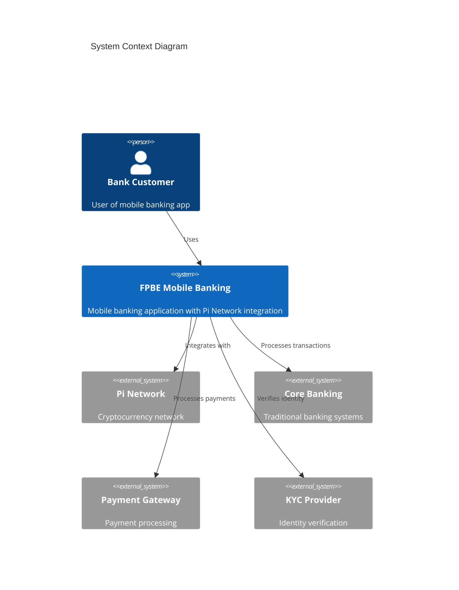

### 2.1.2 Container Diagram (Level 1)

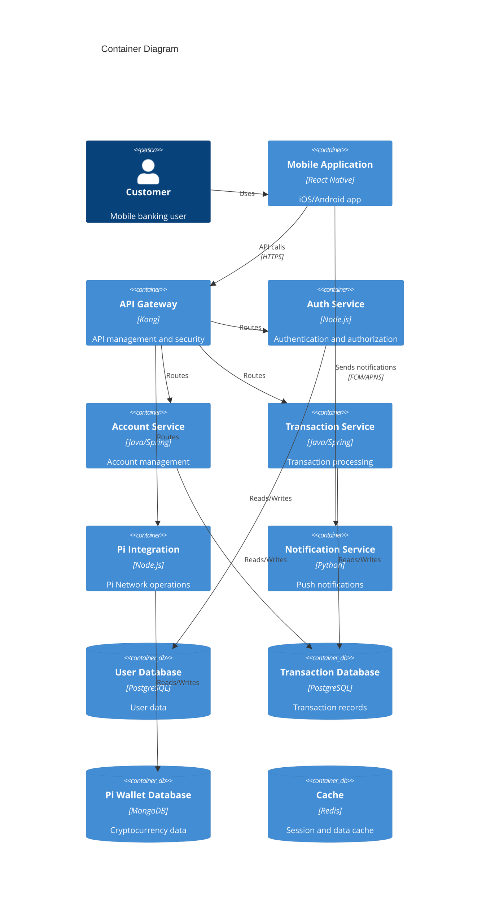

## 2.2 Component Details

### 2.2.1 Mobile Application
- **Technology**: React Native
- **Purpose**: Cross-platform mobile client
- **Key Features**:
  - Offline capability
  - Biometric authentication
  - Local data encryption
  - Push notification handling

### 2.2.2 API Gateway
- **Technology**: Kong
- **Features**:
  - Rate limiting
  - JWT validation
  - Request routing
  - API analytics
  - SSL termination

### 2.2.3 Core Services

| Service | Technology | Purpose | Scaling Strategy |
|---------|------------|---------|------------------|
| Auth Service | Node.js/Express | User authentication | Horizontal with session stickiness |
| Account Service | Java/Spring Boot | Account management | Horizontal with sharding |
| Transaction Service | Java/Spring Boot | Transaction processing | Horizontal with event sourcing |
| Pi Integration | Node.js | Cryptocurrency operations | Vertical with redundancy |
| Notification Service | Python/Flask | Push notifications | Horizontal with queue-based processing |

## 2.3 Technical Decisions

### 2.3.1 Architecture Patterns

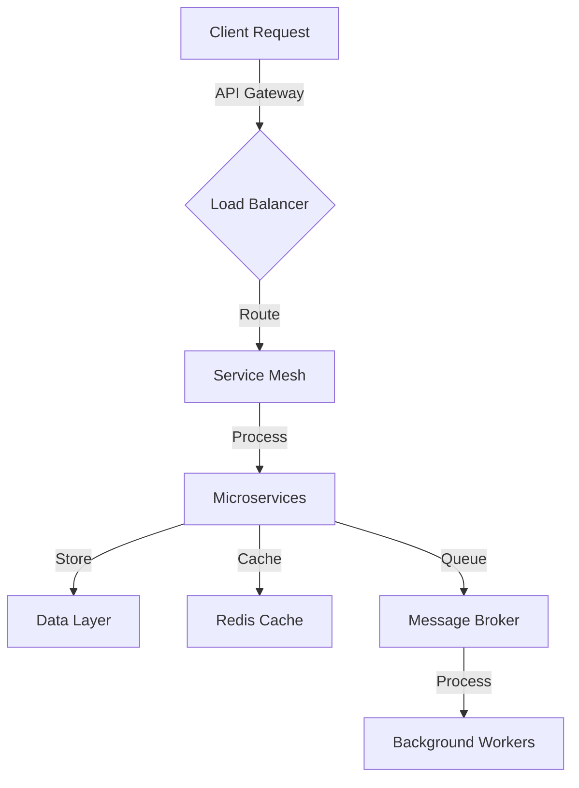

### 2.3.2 Data Storage Solutions

| Data Type | Storage Solution | Justification |
|-----------|-----------------|---------------|
| User Data | PostgreSQL | ACID compliance, relational integrity |
| Transactions | PostgreSQL | Strong consistency, audit trails |
| Wallet Data | MongoDB | Flexible schema, document structure |
| Session Data | Redis | High performance, TTL support |
| Event Logs | Elasticsearch | Full-text search, analytics |

## 2.4 Cross-Cutting Concerns

### 2.4.1 Monitoring and Observability

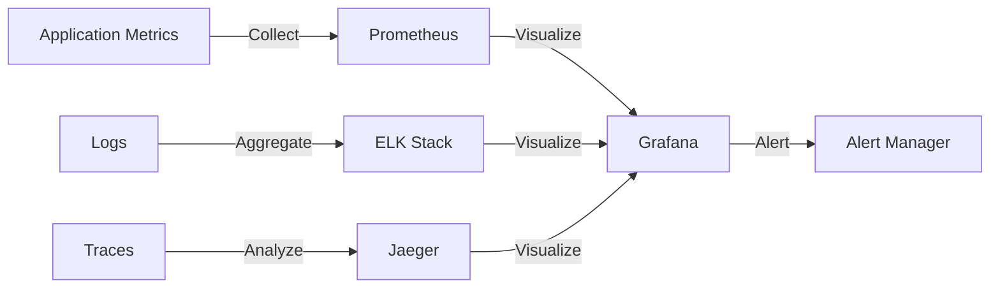

### 2.4.2 Security Architecture

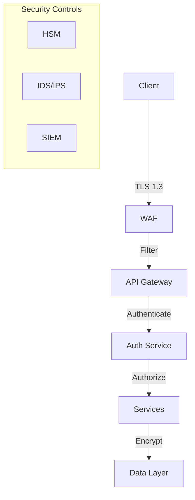

### 2.4.3 Deployment Architecture

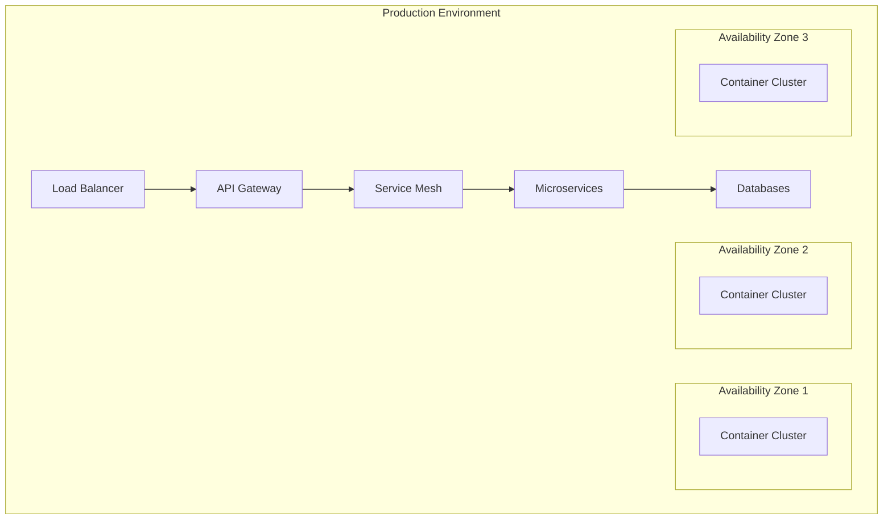

## 2.5 Performance Requirements

| Component | Metric | Target |
|-----------|--------|--------|
| API Response Time | 95th percentile | < 100ms |
| Database Queries | Average | < 10ms |
| Push Notifications | Delivery | < 1s |
| Transaction Processing | End-to-end | < 3s |
| Cache Hit Ratio | Percentage | > 80% |
| API Gateway Latency | Average | < 10ms |

## 2.6 Disaster Recovery

| Scenario | RTO | RPO | Strategy |
|----------|-----|-----|----------|
| Data Center Failure | 4 hours | 15 minutes | Active-active multi-region |
| Database Corruption | 1 hour | 5 minutes | Point-in-time recovery |
| Service Failure | 5 minutes | 0 | Automatic failover |
| Network Outage | 10 minutes | 0 | Multi-provider redundancy |

# 3. SYSTEM COMPONENTS ARCHITECTURE

## 3.1 USER INTERFACE DESIGN

### 3.1.1 Design System Specifications

| Component | Specification | Details |
|-----------|--------------|---------|
| Typography | Primary: SF Pro (iOS), Roboto (Android) | Scale: 12px-32px, 1.5 line height |
| Color Palette | Primary: #1E3A8A<br>Secondary: #3B82F6<br>Accent: #10B981 | WCAG 2.1 AA compliant contrast ratios |
| Spacing System | 4px base unit | Increments: 4, 8, 16, 24, 32, 48, 64px |
| Iconography | Custom icon set + Material Icons | 24x24px touch targets |
| Layout Grid | 12-column system | Breakpoints: 320, 768, 1024, 1440px |
| Dark Mode | Auto-switching based on system | Separate color tokens for modes |

### 3.1.2 Navigation Structure

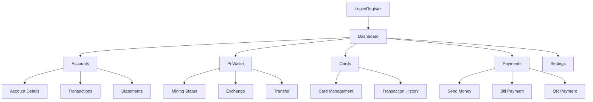

### 3.1.3 Critical User Flows

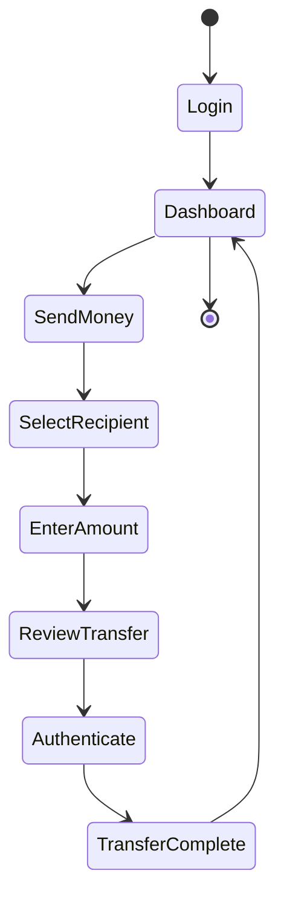

### 3.1.4 Component Specifications

| Component | States | Validation Rules | Accessibility |
|-----------|--------|-----------------|---------------|
| Input Fields | Default, Focus, Error, Disabled | Required fields, Format validation | aria-labels, error messages |
| Buttons | Default, Hover, Active, Loading, Disabled | Action validation | Role="button", keyboard support |
| Forms | Initial, Loading, Success, Error | Field-level validation | Form landmarks, error summary |
| Modals | Open, Closing, Closed | Content validation | Focus trap, escape key support |
| Toast Messages | Info, Success, Warning, Error | Duration rules | aria-live regions |

## 3.2 DATABASE DESIGN

### 3.2.1 Schema Design

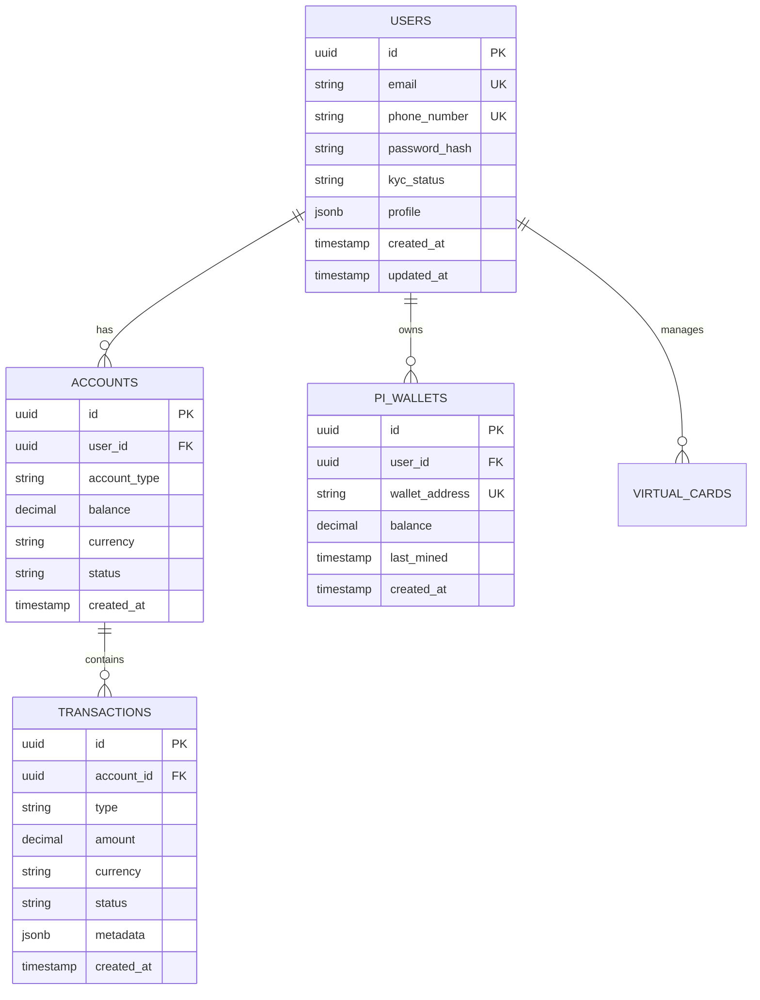

### 3.2.2 Data Management Strategy

| Aspect | Strategy | Implementation |
|--------|----------|----------------|
| Partitioning | Time-based partitioning for transactions | Monthly partitions with range strategy |
| Indexing | Composite indexes for frequent queries | Covering indexes for performance |
| Archival | Rolling window retention | 2 years online, 5 years archived |
| Backup | Continuous incremental backup | Point-in-time recovery capability |
| Encryption | Column-level encryption | AES-256 for sensitive data |
| Auditing | Change Data Capture (CDC) | Audit logs in separate database |

### 3.2.3 Performance Optimization

| Strategy | Implementation | Metrics |
|----------|---------------|---------|
| Query Optimization | Materialized views for reports | Refresh every 15 minutes |
| Caching | Redis for hot data | 15-minute TTL |
| Connection Pooling | HikariCP | Min: 10, Max: 100 connections |
| Replication | Multi-AZ deployment | Async replication with 2 replicas |
| Monitoring | Prometheus + Grafana | Query performance metrics |

## 3.3 API DESIGN

### 3.3.1 API Architecture

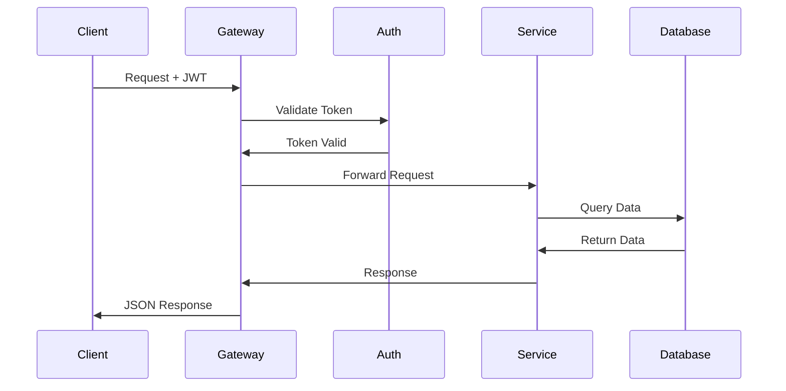

### 3.3.2 API Specifications

| Endpoint | Method | Request Format | Response Format | Auth |
|----------|--------|----------------|-----------------|------|
| /api/v1/auth/login | POST | {email, password} | {token, user} | Public |
| /api/v1/accounts | GET | Authorization header | {accounts[]} | JWT |
| /api/v1/transactions | POST | {from, to, amount} | {transaction} | JWT+2FA |
| /api/v1/pi-wallet | GET | Authorization header | {wallet} | JWT |
| /api/v1/cards | POST | {type, limit} | {card} | JWT+2FA |

### 3.3.3 Integration Patterns

| Pattern | Implementation | Purpose |
|---------|---------------|---------|
| Circuit Breaker | Hystrix | Fault tolerance |
| Rate Limiting | Token bucket | 100 req/min per user |
| Throttling | Sliding window | Burst protection |
| Caching | Redis | Response caching |
| Logging | ELK Stack | Request/response logging |
| Monitoring | Prometheus | API metrics collection |

### 3.3.4 Security Controls

| Control | Implementation | Details |
|---------|---------------|---------|
| Authentication | JWT + OAuth2 | 15-minute token expiry |
| Authorization | RBAC | Role-based permissions |
| Encryption | TLS 1.3 | Perfect forward secrecy |
| API Gateway | Kong | Request validation, transformation |
| Input Validation | JSON Schema | Request payload validation |
| Output Sanitization | Content-Security-Policy | XSS prevention |

# 4. TECHNOLOGY STACK

## 4.1 PROGRAMMING LANGUAGES

| Platform/Component | Language | Version | Justification |
|-------------------|----------|---------|---------------|
| Mobile Apps | TypeScript | 4.9+ | Type safety, React Native compatibility |
| Backend Services | Java | 17 LTS | Enterprise support, Spring ecosystem |
| Pi Integration | Node.js | 18 LTS | Pi SDK compatibility, async processing |
| Smart Contracts | Solidity | 0.8+ | Pi Network blockchain compatibility |
| DevOps Scripts | Python | 3.11+ | Automation, tooling ecosystem |

## 4.2 FRAMEWORKS & LIBRARIES

### Core Frameworks

| Component | Framework | Version | Purpose |
|-----------|-----------|---------|----------|
| Mobile | React Native | 0.71+ | Cross-platform development |
| Backend | Spring Boot | 3.0+ | Microservices architecture |
| API Gateway | Kong | 3.2+ | API management and security |
| Authentication | Spring Security | 6.0+ | Security framework |
| Testing | JUnit/Jest | 5.9+/29+ | Unit/Integration testing |

### Supporting Libraries

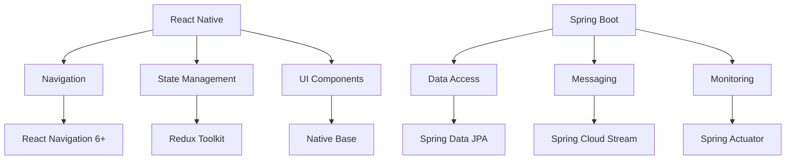

## 4.3 DATABASES & STORAGE

### Primary Databases

| Type | Technology | Version | Usage |
|------|------------|---------|--------|
| Relational | PostgreSQL | 15+ | Transactional data |
| Document | MongoDB | 6.0+ | User profiles, logs |
| In-Memory | Redis | 7.0+ | Caching, sessions |
| Time-Series | InfluxDB | 2.6+ | Metrics, analytics |

### Storage Strategy

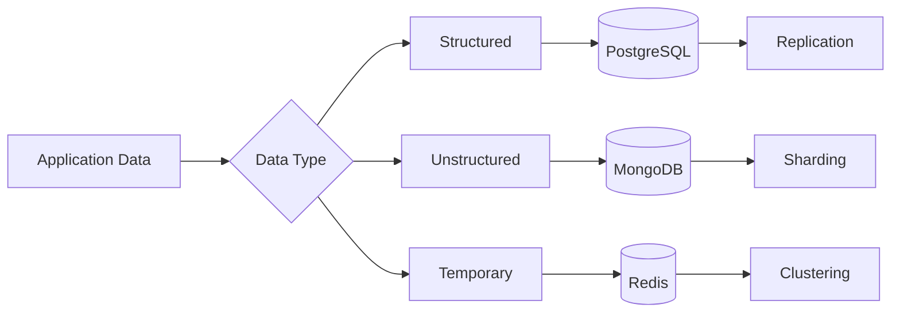

## 4.4 THIRD-PARTY SERVICES

| Category | Service | Purpose | Integration Method |
|----------|---------|---------|-------------------|
| Payment Processing | Stripe | Card payments | REST API |
| KYC/AML | Jumio | Identity verification | SDK |
| Push Notifications | Firebase | User notifications | SDK |
| Email Service | SendGrid | Transactional emails | SMTP/API |
| SMS Gateway | Twilio | 2FA, notifications | REST API |
| Monitoring | Datadog | Application monitoring | Agent/API |
| Cloud Services | AWS | Infrastructure | SDK/API |

## 4.5 DEVELOPMENT & DEPLOYMENT

### Development Environment

| Tool | Purpose | Version |
|------|---------|---------|
| IntelliJ IDEA | Java development | 2023.2+ |
| VS Code | TypeScript/Node.js | Latest |
| Docker Desktop | Containerization | Latest |
| Postman | API testing | Latest |
| Git | Version control | 2.40+ |

### Deployment Pipeline

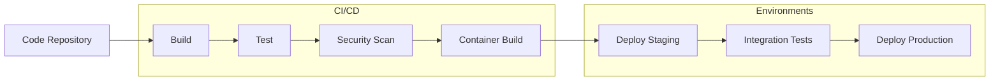

### Infrastructure

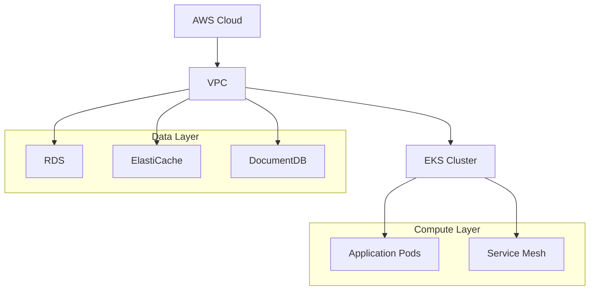

### Containerization Strategy

| Component | Base Image | Size Limit |
|-----------|------------|------------|
| Java Services | Eclipse Temurin | < 200MB |
| Node.js Services | Node Alpine | < 150MB |
| React Native | Node Alpine | < 100MB |
| Nginx | Nginx Alpine | < 50MB |

# 5. SYSTEM DESIGN

## 5.1 USER INTERFACE DESIGN

### 5.1.1 Mobile Application Layout

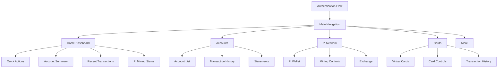

### 5.1.2 Screen Components

| Screen | Components | Interactions |
|--------|------------|--------------|
| Authentication | - Biometric scanner<br>- PIN pad<br>- Password field | - Touch ID/Face ID<br>- Numeric input<br>- Secure text entry |
| Dashboard | - Balance cards<br>- Action buttons<br>- Transaction list | - Swipe between accounts<br>- Pull to refresh<br>- Tap for details |
| Pi Network | - Mining status<br>- Balance display<br>- Exchange rates | - Start/Stop mining<br>- Real-time updates<br>- Rate alerts |
| Virtual Cards | - Card carousel<br>- Control panel<br>- Usage stats | - Card flip animation<br>- Toggle controls<br>- Transaction details |

## 5.2 DATABASE DESIGN

### 5.2.1 Schema Design

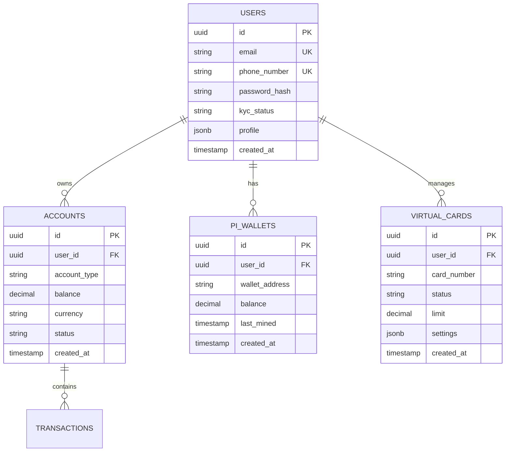

### 5.2.2 Data Storage Strategy

| Data Type | Storage Solution | Justification |
|-----------|-----------------|---------------|
| User Data | PostgreSQL | ACID compliance, relational integrity |
| Transactions | PostgreSQL | Strong consistency, audit trails |
| Session Data | Redis | High performance, TTL support |
| Pi Wallet Data | MongoDB | Flexible schema for blockchain data |
| Audit Logs | Elasticsearch | Full-text search, analytics |

## 5.3 API DESIGN

### 5.3.1 REST API Endpoints

| Endpoint | Method | Purpose | Authentication |
|----------|--------|---------|----------------|
| /api/v1/auth | POST | User authentication | Public |
| /api/v1/accounts | GET | List accounts | JWT |
| /api/v1/transactions | POST | Create transaction | JWT + 2FA |
| /api/v1/cards | GET | List virtual cards | JWT |
| /api/v1/pi-wallet | GET | Pi wallet info | JWT |

### 5.3.2 API Architecture

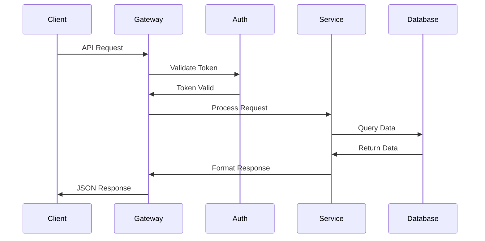

### 5.3.3 Integration Patterns

| Pattern | Implementation | Purpose |
|---------|---------------|---------|
| Circuit Breaker | Hystrix | Fault tolerance |
| Rate Limiting | Redis | API protection |
| Caching | Redis | Performance optimization |
| Event Sourcing | Kafka | Transaction logging |
| API Gateway | Kong | Request routing |

### 5.3.4 WebSocket Events

| Event | Direction | Purpose |
|-------|-----------|---------|
| BALANCE_UPDATE | Server→Client | Real-time balance changes |
| TRANSACTION_COMPLETE | Server→Client | Transaction notifications |
| MINING_STATUS | Server→Client | Pi mining updates |
| EXCHANGE_RATE | Server→Client | Currency rate updates |
| CARD_STATUS | Server→Client | Virtual card status changes |

## 5.4 SECURITY DESIGN


### 5.4.1 Security Controls

| Layer | Control | Implementation |
|-------|---------|----------------|
| Transport | TLS 1.3 | Certificate pinning |
| Network | WAF | ModSecurity rules |
| Application | Authentication | JWT + OAuth2.0 |
| Data | Encryption | AES-256-GCM |
| Infrastructure | Access Control | RBAC + IAM |

# 6. USER INTERFACE DESIGN

## 6.1 Interface Components Key

| Symbol | Meaning |
|--------|---------|
| [#] | Dashboard/Menu |
| [@] | User Profile |
| [$] | Financial Transaction |
| [?] | Help/Support |
| [i] | Information |
| [+] | Add New |
| [x] | Close/Delete |
| [<] [>] | Navigation |
| [^] | Upload |
| [!] | Alert/Warning |
| [=] | Settings |
| [*] | Favorite/Important |

## 6.2 Core Screen Wireframes

### 6.2.1 Login Screen
```
+----------------------------------------+
|           FPBE Mobile Banking          |
|                                        |
|              [@ Login]                 |
|                                        |
|    Email:    [.....................]   |
|    Password: [.....................]   |
|                                        |
|    [?] Forgot Password                 |
|                                        |
|    [Button: Login with Biometrics]     |
|    [Button: Login with PIN]            |
|                                        |
|    [Button: Create Account]            |
|                                        |
|    [?] Help & Support                  |
+----------------------------------------+
```

### 6.2.2 Main Dashboard
```
+----------------------------------------+
| [=] FPBE Banking            [@] Profile |
+----------------------------------------+
| Welcome back, John Doe                  |
| [!] 2 New Notifications                 |
+----------------------------------------+
| Account Balance                         |
| [$] USD 50,000.00                      |
| [+] Add Account                         |
+----------------------------------------+
| Pi Wallet                              |
| [π] 1,000.00 Pi                        |
| [====] Mining Progress 75%              |
+----------------------------------------+
| Quick Actions:                          |
| [$] Send | [$] Receive | [^] Pay Bills  |
+----------------------------------------+
| Recent Transactions:                    |
| [*] Amazon.com    -$50.00              |
| [*] Salary       +$3000.00             |
| [*] Utilities    -$150.00              |
| [>] View All                           |
+----------------------------------------+
| [#] Menu | [$] Pay | [π] Mine | [@] More|
+----------------------------------------+
```

### 6.2.3 Pi Network Integration
```
+----------------------------------------+
| [<] Back           Pi Network    [?]   |
+----------------------------------------+
| Mining Status:                         |
| [====] Active                          |
| Mining Rate: 0.25 Pi/hour              |
|                                        |
| Today's Earnings:                      |
| [π] 2.5 Pi                            |
+----------------------------------------+
| Wallet Balance:                        |
| [π] 1,000.00 Pi                       |
| ≈ $500.00 USD                         |
+----------------------------------------+
| Actions:                               |
| [Button: Start/Stop Mining]            |
| [Button: Convert to Fiat]              |
| [Button: Transfer Pi]                  |
+----------------------------------------+
| Transaction History:                   |
| [>] Mining    +0.25 Pi    12:30 PM    |
| [>] Transfer  -5.00 Pi    09:15 AM    |
| [>] Received  +10.00 Pi   Yesterday   |
+----------------------------------------+
```

### 6.2.4 Virtual Card Management
```
+----------------------------------------+
| [<] Back        Virtual Cards    [+]   |
+----------------------------------------+
|  +----------------------------+        |
|  |  FPBE Virtual Card        |        |
|  |  **** **** **** 1234     |        |
|  |  John Doe                 |        |
|  |  Exp: 12/25    CVV: ***  |        |
|  +----------------------------+        |
|                                       |
| Card Controls:                        |
| [ ] Online Purchases                  |
| [ ] International Transactions        |
| [ ] ATM Withdrawals                   |
|                                       |
| Spending Limit: $5,000                |
| [====================] 100%           |
|                                       |
| Recent Transactions:                  |
| [>] Netflix     -$15.99   Today      |
| [>] Uber        -$25.00   Yesterday  |
| [>] Spotify     -$9.99    03/15      |
+----------------------------------------+
```

## 6.3 Navigation Structure

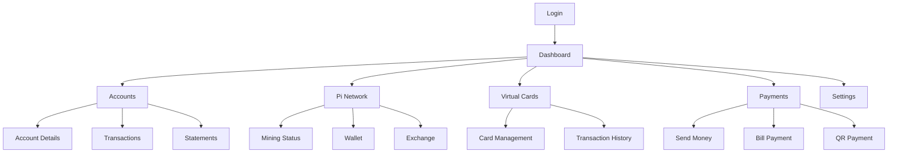

## 6.4 Responsive Design Breakpoints

| Device | Width | Layout Adjustments |
|--------|-------|-------------------|
| Mobile Small | 320px | Single column, stacked components |
| Mobile Large | 375px | Single column, larger touch targets |
| Tablet | 768px | Two-column layout, side navigation |
| Desktop | 1024px | Multi-column, expanded dashboard |

## 6.5 UI Component Specifications

| Component | States | Validation Rules | Accessibility |
|-----------|--------|-----------------|---------------|
| Input Fields | Default, Focus, Error, Disabled | Required fields, Format validation | aria-labels, error messages |
| Buttons | Default, Hover, Active, Loading, Disabled | Action validation | Role="button", keyboard support |
| Cards | Default, Selected, Disabled | Card number validation | Focus indicators |
| Navigation | Active, Inactive | Route validation | Skip links, keyboard navigation |
| Alerts | Info, Success, Warning, Error | Timeout rules | aria-live regions |

## 6.6 Theme Specifications

| Element | Light Theme | Dark Theme |
|---------|------------|------------|
| Background | #FFFFFF | #121212 |
| Primary Text | #333333 | #FFFFFF |
| Secondary Text | #666666 | #AAAAAA |
| Primary Action | #1E3A8A | #3B82F6 |
| Secondary Action | #3B82F6 | #60A5FA |
| Success | #10B981 | #34D399 |
| Error | #EF4444 | #F87171 |
| Warning | #F59E0B | #FBBF24 |
| Border | #E5E7EB | #374151 |

# 7. SECURITY CONSIDERATIONS

## 7.1 AUTHENTICATION AND AUTHORIZATION

### 7.1.1 Authentication Flow

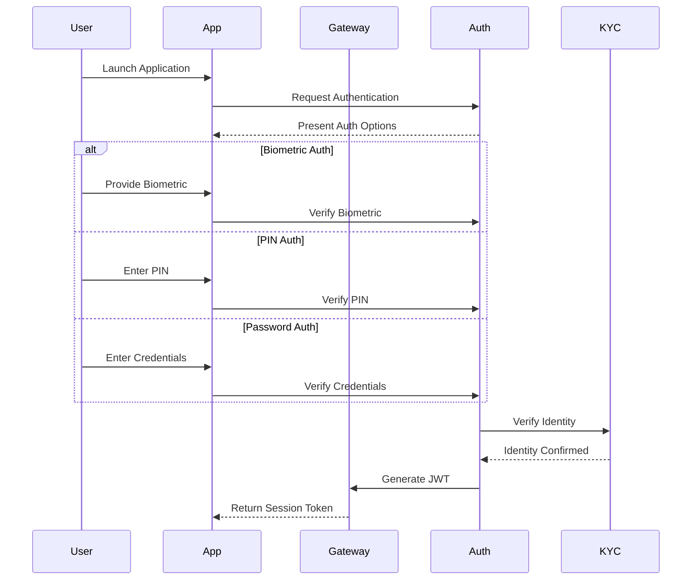

### 7.1.2 Authentication Methods

| Method | Implementation | Security Level |
|--------|---------------|----------------|
| Biometric | TouchID/FaceID/Android Biometric | High - Device-specific |
| PIN | 6-digit encrypted PIN | Medium - Knowledge-based |
| Password | Complex password with hash | Medium - Knowledge-based |
| 2FA | Time-based OTP via SMS/Email | High - Multi-factor |
| Device Binding | Device fingerprinting | High - Hardware-linked |

### 7.1.3 Authorization Matrix

| Role | Account Access | Transaction Limits | Admin Functions | Pi Network Access |
|------|---------------|-------------------|-----------------|------------------|
| Basic User | View Only | $1,000/day | None | Mining Only |
| Verified User | Full Access | $10,000/day | None | Full Access |
| Premium User | Full Access | $50,000/day | None | Full Access + Priority |
| Admin | Full Access | Unlimited | Full Access | Full Access |
| System | Full Access | N/A | Full Access | System Level |

## 7.2 DATA SECURITY

### 7.2.1 Encryption Standards

| Data Type | At Rest | In Transit | Key Management |
|-----------|----------|------------|----------------|
| User Credentials | AES-256 | TLS 1.3 | HSM |
| Transaction Data | AES-256 | TLS 1.3 | HSM |
| Pi Wallet Keys | AES-256 | TLS 1.3 | Cold Storage |
| Session Data | AES-256 | TLS 1.3 | Redis Keystore |
| KYC Documents | AES-256 | TLS 1.3 | HSM |

### 7.2.2 Data Protection Flow

```mermaid
graph TD
    A[User Data] --> B{Encryption Layer}
    B --> C[Field-Level Encryption]
    B --> D[Database Encryption]
    B --> E[Backup Encryption]
    
    C --> F[HSM]
    D --> F
    E --> F
    
    F --> G[Key Management]
    G --> H[Master Keys]
    G --> I[Rotation Policies]
    G --> J[Access Controls]
    
    K[Audit Logging] --> L[SIEM]
    F --> K
    G --> K
```

### 7.2.3 Data Classification

| Level | Description | Security Controls |
|-------|-------------|------------------|
| Critical | Private keys, credentials | HSM, Multi-sig |
| Sensitive | Financial data, KYC | Encryption, Access logs |
| Internal | Transaction metadata | Standard encryption |
| Public | Market data, rates | Integrity checks |

## 7.3 SECURITY PROTOCOLS

### 7.3.1 Network Security

```mermaid
graph TD
    A[Internet] --> B[WAF]
    B --> C[DDoS Protection]
    C --> D[Load Balancer]
    D --> E[API Gateway]
    
    E --> F[App Servers]
    E --> G[Auth Servers]
    
    F --> H[Internal Firewall]
    G --> H
    
    H --> I[Database Servers]
    H --> J[HSM]
    
    K[IDS/IPS] --> L[SIEM]
    M[Security Monitoring] --> L
```

### 7.3.2 Security Controls

| Layer | Control | Implementation |
|-------|---------|----------------|
| Network | Firewall | AWS WAF/Shield |
| Application | WAF | ModSecurity Rules |
| Database | Access Control | RBAC + Row-Level Security |
| API | Rate Limiting | Kong Rate Limiting |
| Session | Token Management | JWT with Short Expiry |
| Infrastructure | Cloud Security | AWS GuardDuty |

### 7.3.3 Security Monitoring

| Component | Monitoring Type | Alert Threshold |
|-----------|----------------|-----------------|
| Failed Logins | Real-time | >5 attempts/minute |
| API Usage | Real-time | >1000 requests/minute |
| Database Access | Real-time | Unauthorized attempts |
| System Resources | Continuous | >80% utilization |
| Network Traffic | Real-time | Anomaly detection |
| Security Events | Real-time | Critical/High severity |

### 7.3.4 Incident Response

| Phase | Actions | Responsibility |
|-------|---------|---------------|
| Detection | Monitor alerts, Log analysis | Security Team |
| Containment | Block threats, Isolate systems | DevOps Team |
| Eradication | Remove threats, Patch systems | Security Team |
| Recovery | Restore services, Verify security | Operations Team |
| Lessons Learned | Update procedures, Improve controls | Management Team |

### 7.3.5 Compliance Requirements

| Standard | Requirement | Implementation |
|----------|-------------|----------------|
| PCI DSS | Card data security | Tokenization, Encryption |
| GDPR | Data protection | Consent, Right to erasure |
| KYC/AML | Identity verification | Document verification |
| SOC 2 | Security controls | Audit logging, Monitoring |
| ISO 27001 | Security management | ISMS implementation |

# 8. INFRASTRUCTURE

## 8.1 DEPLOYMENT ENVIRONMENT

The FPBE mobile banking system utilizes a hybrid cloud deployment model with the following architecture:

```mermaid
graph TD
    subgraph On-Premises
        A[Core Banking] --> B[Private Cloud]
        C[HSM] --> B
        D[Compliance Systems] --> B
    end
    
    subgraph Public Cloud
        E[Application Tier]
        F[Data Tier]
        G[Cache Tier]
        H[Analytics]
    end
    
    B <--> E
    E <--> F
    E <--> G
    F --> H
```

| Component | Environment | Justification |
|-----------|-------------|---------------|
| Core Banking | On-Premises | Regulatory compliance, data sovereignty |
| User Data | Public Cloud | Scalability, global accessibility |
| Application Services | Public Cloud | Elastic scaling, high availability |
| Security Systems | Hybrid | Balance between control and flexibility |
| Analytics | Public Cloud | Cost-effective data processing |

## 8.2 CLOUD SERVICES

### Primary Cloud Provider: AWS

| Service | Usage | Justification |
|---------|-------|---------------|
| EKS | Container orchestration | Native Kubernetes support, scalability |
| RDS | Database management | Managed PostgreSQL with high availability |
| ElastiCache | Caching layer | Redis clustering, automatic failover |
| DocumentDB | Document storage | MongoDB compatibility, managed service |
| CloudFront | Content delivery | Global edge locations, low latency |
| Route 53 | DNS management | Global DNS with health checking |
| WAF | Security | DDoS protection, traffic filtering |

### Multi-Cloud Strategy

```mermaid
graph LR
    subgraph AWS Primary
        A[EKS Clusters]
        B[RDS]
        C[ElastiCache]
    end
    
    subgraph GCP DR
        D[GKE Clusters]
        E[Cloud SQL]
        F[Memorystore]
    end
    
    A <--> D
    B <--> E
    C <--> F
```

## 8.3 CONTAINERIZATION

### Docker Configuration

| Component | Base Image | Size Limit | Configuration |
|-----------|------------|------------|---------------|
| API Services | eclipse-temurin:17-jre-alpine | 200MB | Multi-stage builds |
| Frontend | node:alpine | 100MB | Nginx for static assets |
| Workers | python:3.11-slim | 150MB | Process-specific images |
| Monitoring | grafana/grafana-oss | 200MB | Pre-configured dashboards |

### Container Security

```mermaid
graph TD
    A[Container Registry] --> B{Security Scanner}
    B -->|Pass| C[Deployment]
    B -->|Fail| D[Notification]
    
    C --> E[Runtime Security]
    E --> F[Image Signing]
    E --> G[Policy Enforcement]
    E --> H[Vulnerability Monitoring]
```

## 8.4 ORCHESTRATION

### Kubernetes Architecture

```mermaid
graph TD
    subgraph Production Cluster
        A[Ingress Controller]
        B[Service Mesh]
        C[Application Pods]
        D[Monitoring]
        
        A --> B
        B --> C
        C --> D
    end
    
    subgraph Management
        E[GitOps Controller]
        F[Policy Engine]
        G[Secrets Management]
    end
    
    E --> Production Cluster
    F --> Production Cluster
    G --> Production Cluster
```

### Cluster Configuration

| Component | Implementation | Purpose |
|-----------|---------------|----------|
| Service Mesh | Istio | Traffic management, security |
| GitOps | ArgoCD | Declarative deployments |
| Monitoring | Prometheus/Grafana | Metrics and visualization |
| Logging | EFK Stack | Log aggregation |
| Secrets | Vault | Secrets management |

## 8.5 CI/CD PIPELINE

### Pipeline Architecture

```mermaid
graph LR
    A[Source Code] --> B[Build]
    B --> C[Test]
    C --> D[Security Scan]
    D --> E[Container Build]
    E --> F[Deploy Dev]
    F --> G[Integration Tests]
    G --> H[Deploy Staging]
    H --> I[E2E Tests]
    I --> J[Deploy Prod]
    
    subgraph Quality Gates
        K[Code Coverage]
        L[Security Checks]
        M[Performance Tests]
    end
    
    C --> K
    D --> L
    I --> M
```

### Pipeline Tools

| Stage | Tool | Purpose |
|-------|------|---------|
| Source Control | GitLab | Version control, CI/CD platform |
| Build | Maven/Gradle | Java service builds |
| Testing | JUnit/Jest | Unit and integration testing |
| Security | SonarQube | Code quality and security |
| Container Registry | Harbor | Private container registry |
| Deployment | ArgoCD | GitOps deployments |
| Monitoring | Datadog | Application performance monitoring |

### Deployment Strategy

| Environment | Strategy | Rollback Time |
|-------------|----------|---------------|
| Development | Direct Deploy | Immediate |
| Staging | Blue/Green | < 5 minutes |
| Production | Canary | < 15 minutes |

### Automation Rules

| Event | Action | SLA |
|-------|--------|-----|
| Code Push | Build & Test | < 15 minutes |
| Security Issue | Block Deploy | Immediate |
| Test Failure | Notify Team | < 5 minutes |
| Deploy Success | Health Check | < 2 minutes |
| Deploy Failure | Auto Rollback | < 5 minutes |

# 8. APPENDICES

## 8.1 ADDITIONAL TECHNICAL INFORMATION

### 8.1.1 Pi Network Integration Details

```mermaid
graph TD
    A[Pi SDK Integration] --> B{Features}
    B --> C[Mining]
    B --> D[Wallet]
    B --> E[Transactions]
    
    C --> C1[Background Mining]
    C --> C2[Mining Rate Control]
    C --> C3[Mining Statistics]
    
    D --> D1[Balance Management]
    D --> D2[Address Generation]
    D --> D3[Key Storage]
    
    E --> E1[Transaction Creation]
    E --> E2[Block Confirmation]
    E --> E3[Transaction History]
```

### 8.1.2 Security Implementation Matrix

| Layer | Technology | Implementation Details |
|-------|------------|----------------------|
| Application | Spring Security | OAuth2.0, JWT tokens, CORS |
| Transport | TLS 1.3 | Perfect forward secrecy, certificate pinning |
| Database | PostgreSQL | Row-level security, encryption at rest |
| Infrastructure | AWS Security Groups | Network isolation, WAF rules |
| Hardware | HSM | FIPS 140-2 Level 3 compliance |

### 8.1.3 Performance Optimization Techniques

| Component | Technique | Expected Improvement |
|-----------|-----------|---------------------|
| API Responses | Redis Caching | 80% reduction in response time |
| Database Queries | Query Optimization | 60% faster query execution |
| Mobile App | Image Optimization | 40% reduction in load time |
| Network Calls | Request Batching | 50% reduction in API calls |
| Background Tasks | Task Queuing | 70% better resource utilization |

## 8.2 GLOSSARY

| Term | Definition |
|------|------------|
| Atomic Transaction | Database operation that either completes entirely or fails completely |
| Circuit Breaker | Design pattern that prevents cascading failures in distributed systems |
| Event Sourcing | Pattern of storing data as a sequence of events |
| Idempotency | Property where an operation produces the same result regardless of repetition |
| Load Balancing | Distribution of workloads across multiple computing resources |
| Microservices | Architecture style where applications are collections of loosely coupled services |
| Rate Limiting | Controlling the rate of requests to or from a system |
| Service Mesh | Infrastructure layer for handling service-to-service communication |
| Sharding | Database partitioning that separates large databases into smaller parts |
| Zero Trust | Security concept requiring strict verification for all system access |

## 8.3 ACRONYMS

| Acronym | Full Form |
|---------|-----------|
| ACID | Atomicity, Consistency, Isolation, Durability |
| APNS | Apple Push Notification Service |
| CDN | Content Delivery Network |
| CORS | Cross-Origin Resource Sharing |
| DDoS | Distributed Denial of Service |
| ELK | Elasticsearch, Logstash, Kibana |
| FCM | Firebase Cloud Messaging |
| FIPS | Federal Information Processing Standards |
| gRPC | Google Remote Procedure Call |
| HSM | Hardware Security Module |
| JDBC | Java Database Connectivity |
| JWT | JSON Web Token |
| MQTT | Message Queuing Telemetry Transport |
| ODBC | Open Database Connectivity |
| RBAC | Role-Based Access Control |
| REST | Representational State Transfer |
| SDK | Software Development Kit |
| SIEM | Security Information and Event Management |
| TLS | Transport Layer Security |
| WAF | Web Application Firewall |

## 8.4 SYSTEM DEPENDENCIES

```mermaid
graph LR
    A[Mobile App] --> B{Core Dependencies}
    B --> C[Frontend]
    B --> D[Backend]
    B --> E[Infrastructure]
    
    C --> C1[React Native 0.71+]
    C --> C2[Native Base UI]
    C --> C3[Redux Toolkit]
    
    D --> D1[Spring Boot 3.0+]
    D --> D2[Node.js 18 LTS]
    D --> D3[PostgreSQL 15+]
    
    E --> E1[AWS Services]
    E --> E2[Kong Gateway]
    E --> E3[Docker/K8s]
```

## 8.5 COMPLIANCE MATRIX

| Requirement | Standard | Implementation |
|------------|----------|----------------|
| Data Protection | GDPR | Encryption, Data minimization |
| Banking Security | PCI DSS | HSM, Access controls |
| Authentication | NIST 800-63 | MFA, Biometrics |
| API Security | OWASP API | Rate limiting, Input validation |
| Accessibility | WCAG 2.1 | Screen readers, Color contrast |
| Cryptocurrency | FinCEN | KYC, Transaction monitoring |
| Cloud Security | ISO 27017 | Encryption, Access management |
| Mobile Security | OWASP MASVS | App hardening, Secure storage |