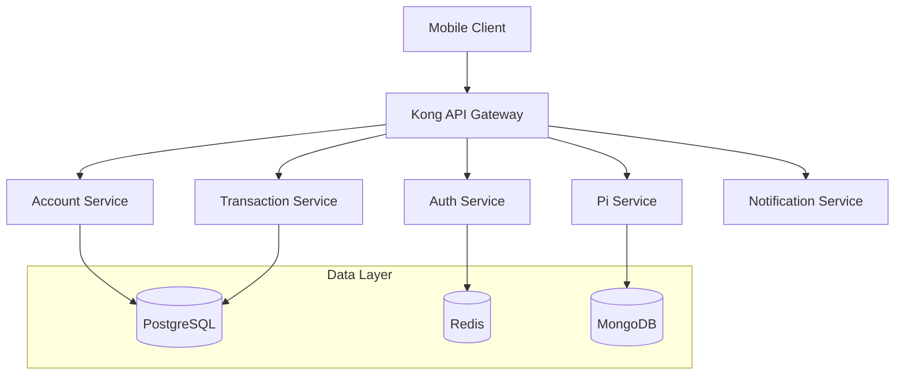
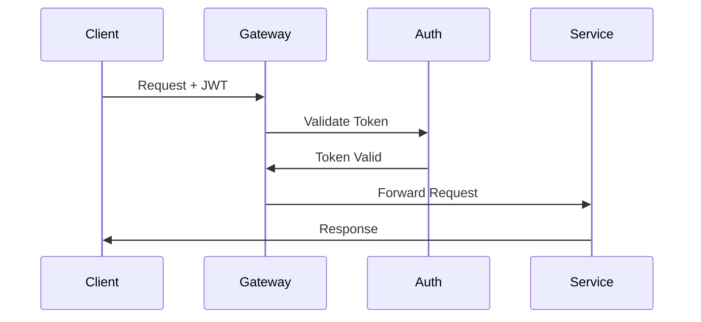

# FPBE Mobile Banking Backend Services

## Overview

The FPBE (First PIMISR Bank Elmahrosa) mobile banking backend is a microservices-based architecture that provides secure, scalable, and high-performance banking services with integrated Pi Network cryptocurrency capabilities.

## Architecture



### Core Services

| Service | Technology | Purpose |
|---------|------------|---------|
| API Gateway | Kong 3.2 | Request routing, authentication, rate limiting |
| Auth Service | Node.js 18 LTS | User authentication and authorization |
| Account Service | Java 17/Spring Boot 3.0 | Account management and operations |
| Transaction Service | Java 17/Spring Boot 3.0 | Transaction processing and history |
| Pi Service | Node.js 18 LTS | Pi Network integration and mining |
| Notification Service | Python 3.11 | Push notifications and alerts |

## Development Setup

### Prerequisites

- Docker 20.10+
- Docker Compose 2.0+
- Java Development Kit 17
- Node.js 18 LTS
- Python 3.11
- PostgreSQL 15
- Redis 7.0
- MongoDB 6.0

### Environment Configuration

1. Clone the repository:
```bash
git clone https://github.com/fpbe/mobile-banking.git
cd mobile-banking/backend
```

2. Copy environment template:
```bash
cp .env.example .env
```

3. Configure environment variables following security guidelines in `.env.example`

### Local Development

1. Start infrastructure services:
```bash
docker-compose up -d postgres redis mongodb
```

2. Start core services:
```bash
docker-compose up -d api-gateway auth-service account-service transaction-service pi-service notification-service
```

### Service URLs

- API Gateway: https://localhost:8443
- Auth Service: http://localhost:8081
- Account Service: http://localhost:8082
- Transaction Service: http://localhost:8083
- Pi Service: http://localhost:8084
- Notification Service: http://localhost:8085

## Security Implementation

### Authentication Flow



### Security Controls

- TLS 1.3 encryption for all communications
- JWT-based authentication with short-lived tokens
- Multi-factor authentication support
- Rate limiting and DDoS protection
- Encrypted data at rest
- Audit logging for all operations

## Performance Optimization

### Database Configuration

- Connection pooling with HikariCP
- Query optimization and indexing
- Read replicas for scaling
- Caching strategy with Redis
- Database sharding for high volume

### Monitoring Setup

- Prometheus metrics collection
- Grafana dashboards
- ELK stack for log aggregation
- APM for performance tracking
- Health check endpoints

## Disaster Recovery

### Backup Strategy

- Automated daily backups
- Point-in-time recovery
- Cross-region replication
- Regular backup testing
- 30-day retention policy

### High Availability

- Multi-AZ deployment
- Automatic failover
- Load balancing
- Circuit breakers
- Rate limiting

## API Documentation

API documentation is available at:
- Development: https://api-dev.fpbe.com/docs
- Staging: https://api-staging.fpbe.com/docs
- Production: https://api.fpbe.com/docs

## Contributing

1. Follow Git flow branching model
2. Ensure tests pass locally
3. Submit pull request with detailed description
4. Code review required before merge
5. CI/CD pipeline must pass

## License

Copyright © 2023 First PIMISR Bank Elmahrosa. All rights reserved.